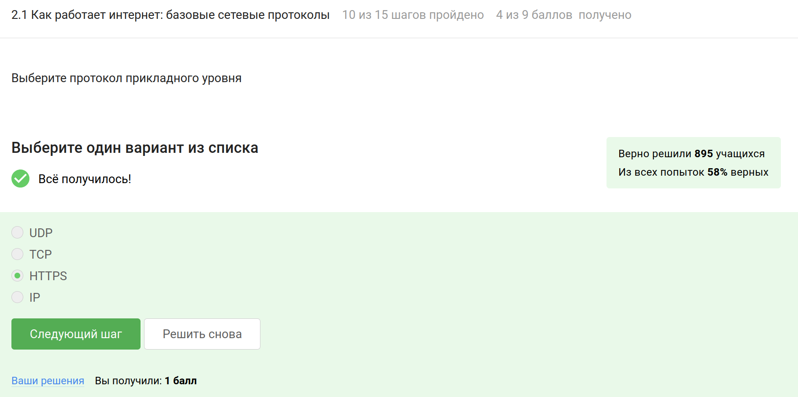
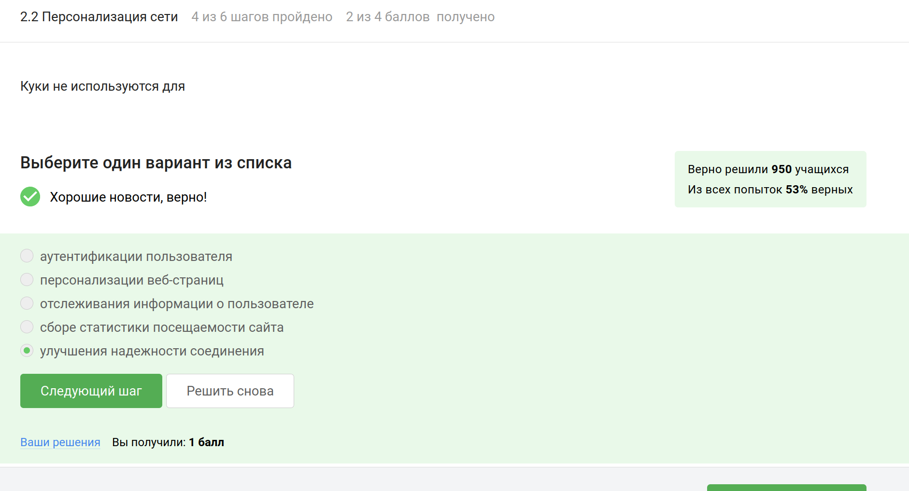
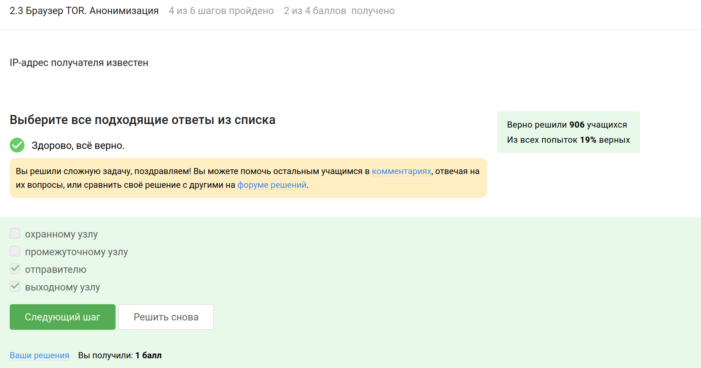

---
## Front matter
lang: ru-RU
title: Внешний курс «‎Основы кибербезопасности»
subtitle: Безопасность в сети
author:
  - Карпова Е.А.
institute:
  - Российский университет дружбы народов, Москва, Россия
date: 8.05.2025

## i18n babel
babel-lang: russian
babel-otherlangs: english

## Formatting pdf
toc: false
toc-title: Содержание
slide_level: 2
aspectratio: 169
section-titles: true
theme: metropolis
header-includes:
 - \metroset{progressbar=frametitle,sectionpage=progressbar,numbering=fraction}
 - '\makeatletter'
 - '\beamer@ignorenonframefalse'
 - '\makeatother'
---
# Информация

## Докладчик

:::::::::::::: {.columns align=center}
::: {.column width="70%"}

  * Карпова Есения Алексеевна
  * Студентка НКАбд-02-23
  * ФФМиЕН
  * Российский университет дружбы народов
  * [1132236008@pfur.ru](mailto:1132236008@pfur.ru)
  * <https://github.com/eakarpova>

:::
::: {.column width="30%"}

:::
::::::::::::::

# Вводная часть

## Цели и задачи

- Как работает Интернет и базовые сетевые протоколы

- Как достигается персонализация пользователя в Сети

- Какие механизмы существуют для анонимизации пользователя в сети

- Как обеспечивается безопасность в беспроводных сетях

# Выполнение внешнего курса

## Как работает интернет: базовые сетевые протоколы

### Выберите протокол прикладного уровня

{#fig:001 width=100%}

## Персонализация сети

### Куки не используются для

{#fig:011 width=100%}

## Браузер TOR. Анонимизация

### IP-адрес получателя известен

{#fig:015 width=100%}

## Беспроводные сети Wi-fi

### Wi-Fi - это

{#fig:018 width=100%}

# Выводы

Я прошла первый этап "Безопасность в сети" внешнего курса "Основы кибербезопасности" и изучила работу Интернета и базовых сетевых протоколов
