---
## Front matter
title: "Внешний курс «‎Основы кибербезопасности» "
subtitle: "Безопасность в сети"
author: "Карпова Есения Алексеевна"

## Generic otions
lang: ru-RU
toc-title: "Содержание"

## Bibliography
bibliography: bib/cite.bib
csl: pandoc/csl/gost-r-7-0-5-2008-numeric.csl

## Pdf output format
toc: true # Table of contents
toc-depth: 2
lof: true # List of figures
lot: true # List of tables
fontsize: 12pt
linestretch: 1.5
papersize: a4
documentclass: scrreprt
## I18n polyglossia
polyglossia-lang:
  name: russian
  options:
	- spelling=modern
	- babelshorthands=true
polyglossia-otherlangs:
  name: english
## I18n babel
babel-lang: russian
babel-otherlangs: english
## Fonts
mainfont: IBM Plex Serif
romanfont: IBM Plex Serif
sansfont: IBM Plex Sans
monofont: IBM Plex Mono
mathfont: STIX Two Math
mainfontoptions: Ligatures=Common,Ligatures=TeX,Scale=0.94
romanfontoptions: Ligatures=Common,Ligatures=TeX,Scale=0.94
sansfontoptions: Ligatures=Common,Ligatures=TeX,Scale=MatchLowercase,Scale=0.94
monofontoptions: Scale=MatchLowercase,Scale=0.94,FakeStretch=0.9
mathfontoptions:
## Biblatex
biblatex: true
biblio-style: "gost-numeric"
biblatexoptions:
  - parentracker=true
  - backend=biber
  - hyperref=auto
  - language=auto
  - autolang=other*
  - citestyle=gost-numeric
## Pandoc-crossref LaTeX customization
figureTitle: "Рис."
tableTitle: "Таблица"
listingTitle: "Листинг"
lofTitle: "Список иллюстраций"
lotTitle: "Список таблиц"
lolTitle: "Листинги"
## Misc options
indent: true
header-includes:
  - \usepackage{indentfirst}
  - \usepackage{float} # keep figures where there are in the text
  - \floatplacement{figure}{H} # keep figures where there are in the text
---

# Цель работы

Пройти первый этап "Безопасность в сети" внешнего курса "Основы кибербезопасности"

# Задание

Изучить:

- Как работает Интернет и базовые сетевые протоколы

- Как достигается персонализация пользователя в Сети

- Какие механизмы существуют для анонимизации пользователя в сети

- Как обеспечивается безопасность в беспроводных сетях

# Теоретическое введение

Модель TCP/IP состоит из 4 уровней. Прикладной уровень отвечает за взаимодействие пользовательских программ (например, браузеров через HTTP/HTTPS или почтовых клиентов через SMTP) с интернет-сервисами. Транспортный уровень (TCP и UDP) обеспечивает надежную или быструю передачу данных между процессами на разных устройствах. Сетевой уровень (IP) управляет маршрутизацией пакетов между различными физическими сетями, а канальный уровень (Ethernet, Wi-Fi) обеспечивает физическую передачу данных. Вся эта многоуровневая система позволяет преобразовать запрос пользователя (например, ввод адреса yandex.ru) в загрузку веб-страницы, проходя последовательно все этапы обработки данных.

Персонализация в сети достигается с помощью файлов cookie, которые передаются от сервера к браузеру пользователя для его идентификации. Куки позволяют сохранять пользовательские данные, такие как сессионная информация (например, содержимое корзины в интернет-магазине) или предпочтения (например, выбор языка страницы). Однако они также могут использоваться для отслеживания действий пользователя, что позволяет рекламным сервисам показывать персонализированную рекламу на разных сайтах. Куки бывают сессионными (удаляются после закрытия браузера) и постоянными (сохраняются для аутентификации и сбора статистики), а также различаются по источнику — прямые (от посещаемого сайта) и сторонние (от рекламных сервисов). Блокировка сторонних cookie повышает приватность, но полный отказ от них значительно снижает удобство работы в сети, так как требует постоянной повторной авторизации.

Tor — это сеть, обеспечивающая анонимность и конфиденциальность пользователей через луковую маршрутизацию, где данные последовательно шифруются и передаются через три узла: охранный, промежуточный и выходной. В отличие от классической маршрутизации, ни один узел (кроме охранного и выходного) не знает полного пути пакета, что исключает отслеживание отправителя и получателя. Конфиденциальность достигается за счёт многослойного шифрования: каждый узел расшифровывает только свой "слой", подобно очистке лука, и передаёт данные дальше. Хотя Tor эффективно скрывает IP-адрес пользователя, замедляя соединение, он не гарантирует абсолютной анонимности из-за возможных атак и блокировок в некоторых странах. Браузер Tor, внешне похожий на обычные браузеры, маскирует местоположение пользователя, подменяя его IP-адресом выходного узла, что делает его популярным инструментом для приватного серфинга, несмотря на спорные аспекты использования.

Безопасность в беспроводных сетях (WiFi) обеспечивается через шифрование и аутентификацию, реализуемые стандартами WPA, WPA2 и WPA3, которые пришли на смену уязвимому WEP. Современные алгоритмы используют AES-шифрование с ключами длиной от 128 бит, генерируемыми на основе пароля пользователя, что защищает передаваемые данные от перехвата. Аутентификация может быть двух типов: Personal (домашние сети с паролем) и Enterprise (корпоративные сети с серверной проверкой доступа). Важным свойством WPA3 является устойчивость к атакам на слабые пароли и forward secrecy, предотвращающая компрометацию прошлых сессий при утечке ключа. WiFi работает на канальном уровне модели TCP/IP, обеспечивая беспроводную передачу данных по радиоканалу, аналогично проводному Ethernet, но с дополнительными механизмами защиты от помех и несанкционированного доступа.

# Выполнение внешнего курса

## Как работает интернет: базовые сетевые протоколы

HTTPS – единственный протокол из списка, относящийся к прикладному уровню(рис. [-@fig:001]).

{#fig:001 width=100%}

TCP работает на транспортном уровне (4-й уровень OSI). Он обеспечивает надежную доставку данных, например, для HTTP или FTP (рис. [-@fig:002]).

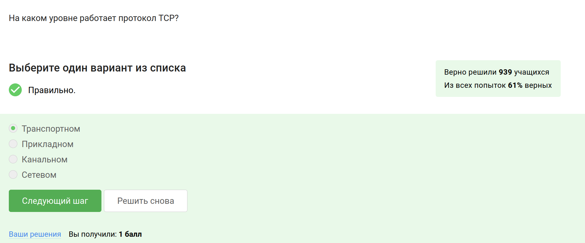{#fig:2 width=100%}

Корректными являются ответы, в которых числа < 255 (рис. [-@fig:003]).

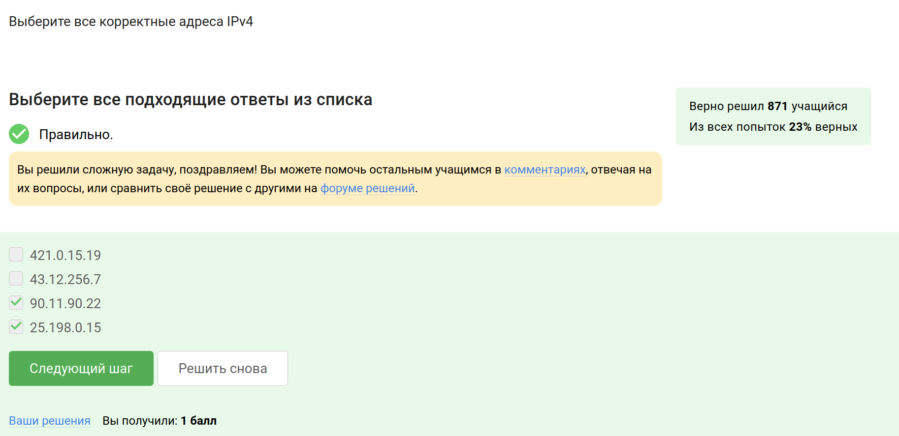{#fig:003 width=100%}

DNS сервер сопоставляет IP адреса доменным именам. Остальные функции не относятся к DNS (сегментация данных выполняется на транспортном уровне протоколом TCP, выбор маршрута пакета - задача сетевого уровня и маршрутизаторов, адресация на хосте осуществляется протоколами канального уровня типа ARP) (рис. [-@fig:004]).

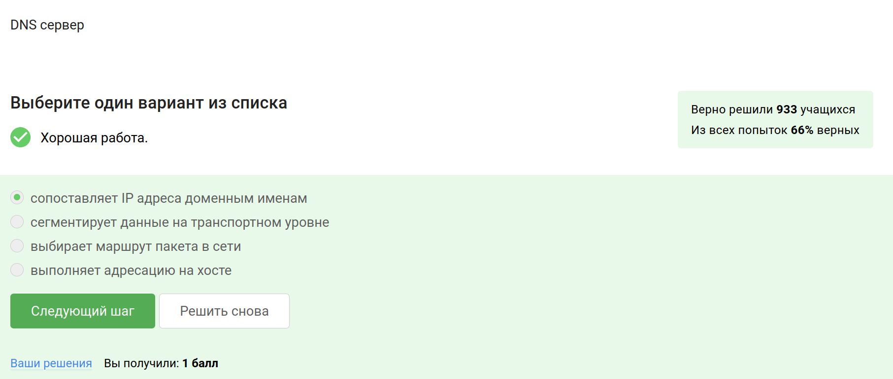{#fig:004 width=100%}

Правильная последовательность: прикладной — транспортный — сетевой — канальный, другие варианты нарушают порядок уровней (рис. [-@fig:005]).

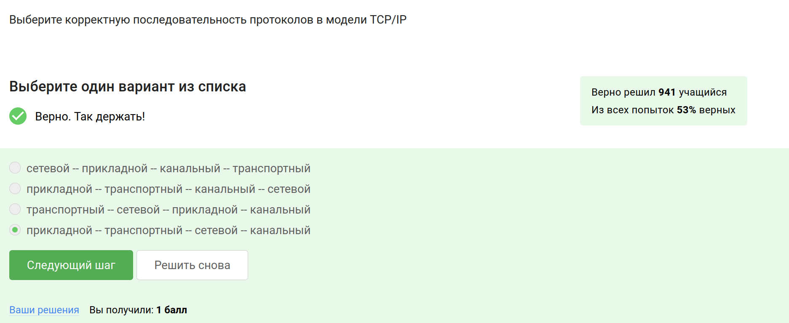{#fig:005 width=100%}

Протокол HTTP передает данные между клиентом и сервером в открытом виде, без шифрования. (рис. [-@fig:006]).

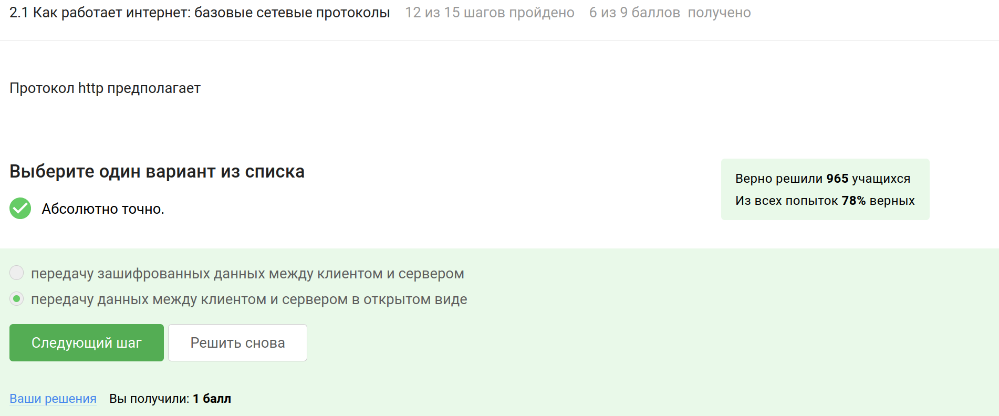{#fig:006 width=100%}

Протокол HTTPS включает две основные фазы: рукопожатие (TLS handshake), где происходит аутентификация сервера и согласование параметров шифрования, и передачу данных, которая осуществляется в зашифрованном виде (рис. [-@fig:007]).

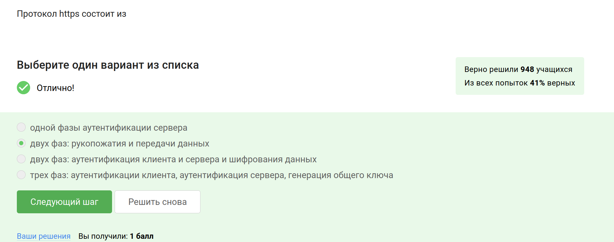{#fig:007 width=100%}

Версия протокола TLS определяется в процессе переговоров между клиентом и сервером: клиент предлагает поддерживаемые версии, а сервер выбирает наиболее безопасную из доступных обоим (рис. [-@fig:008]).

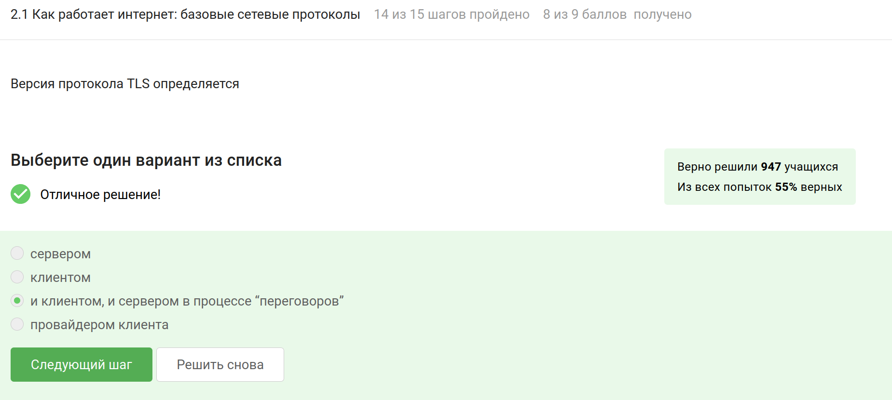{#fig:008 width=100%}

В фазе "рукопожатия" TLS предусмотрено формирование общего секретного ключа, аутентификация сервера (и опционально клиента), а также согласование алгоритмов шифрования. Шифрование данных начинается только после завершения рукопожатия, поэтому сам процесс проходит в открытом виде. (рис. [-@fig:009]).

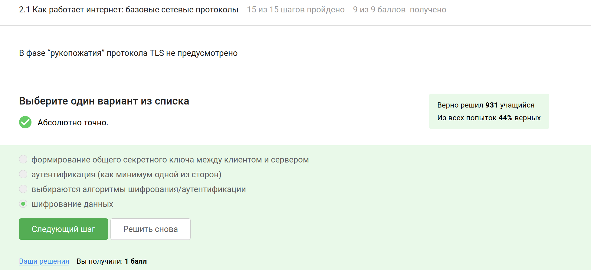{#fig:009 width=100%}

## Персонализация сети

Куки хранят идентификатор сессии или уникальный идентификатор пользователя для аутентификации и отслеживания состояния сеанса. Но они не должны содержать пароли или IP-адреса, так как это нарушает безопасность и конфиденциальность. (рис. [-@fig:010]).

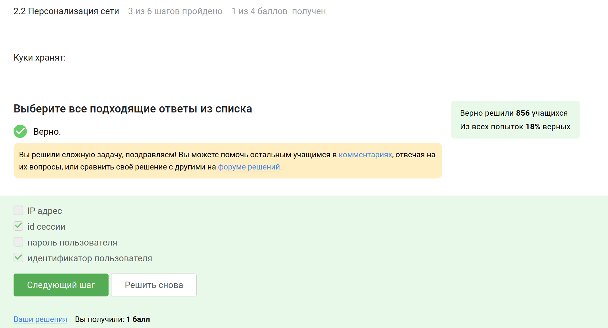{#fig:010 width=100%}

Куки не используются для улучшения надежности соединения, так как это техническая задача, решаемая на уровне протоколов (рис. [-@fig:011]).

{#fig:011 width=100%}

Клиент лишь хранит и передаёт куки, но не генерирует их самостоятельно, куки создаются сервером (рис. [-@fig:012]).

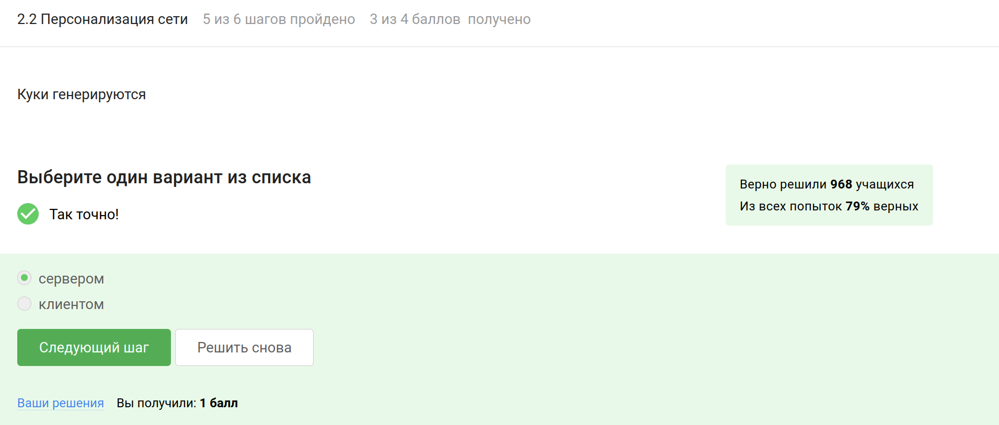{#fig:012 width=100%}

Сессионные куки хранятся в браузере только во время текущей сессии и удаляются после закрытия вкладки или браузера (рис. [-@fig:013]).

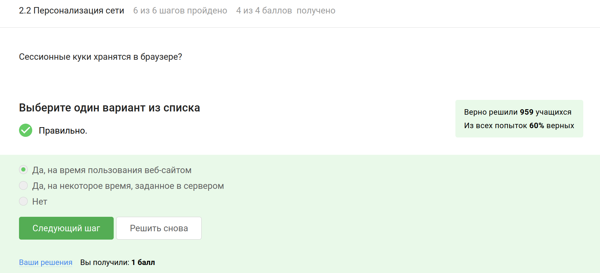{#fig:013 width=100%}

## Браузер TOR. Анонимизация

В сети Tor трафик проходит через три промежуточных узла (guard relay, middle relay и exit relay), что обеспечивает анонимность (рис. [-@fig:014]).
работает Интернет и базовые сетевые протоколы
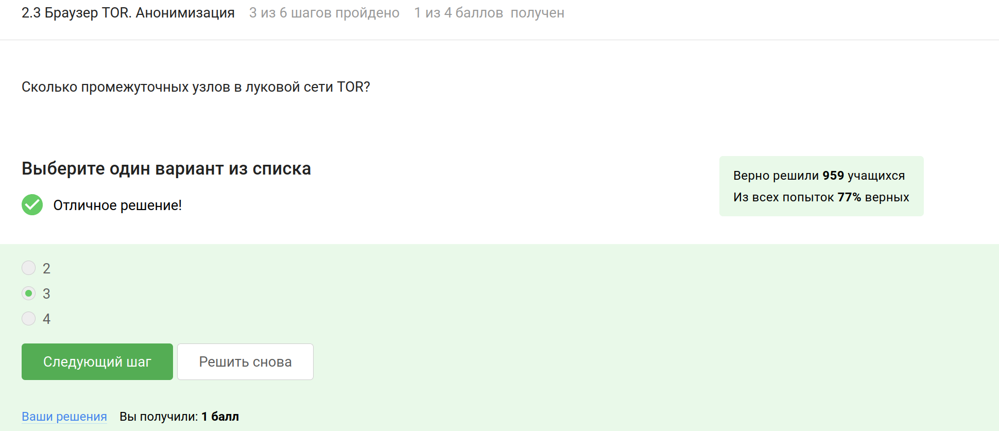{#fig:014 width=100%}

IP-адрес получателя известен отправителю и выходному узлу, так как он завершает цепочку и передаёт трафик в открытую сеть (рис. [-@fig:015]).

{#fig:015 width=100%}

При использовании onion routing общий секретный ключ для каждого "слоя" шифрования генерируется отправителем для каждого узла (рис. [-@fig:016]).

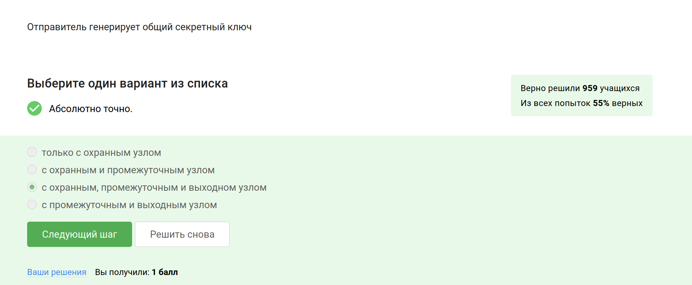{#fig:016 width=100%}

Браузер Tor служит для повышения конфиденциальности, но не является обязательным для успешной доставки пакетов. (рис. [-@fig:017]).

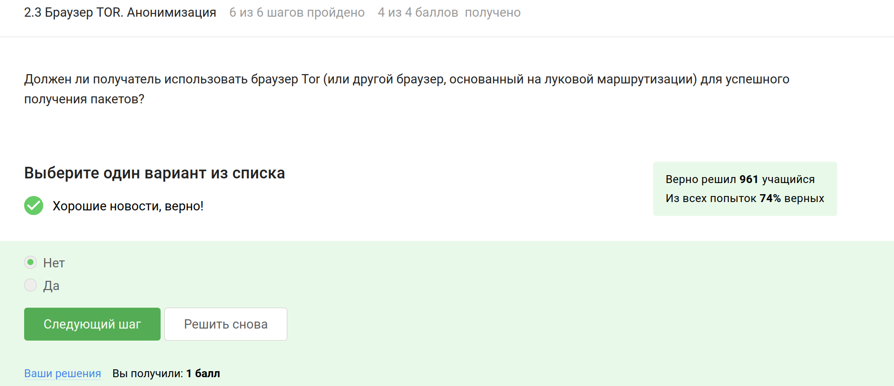{#fig:017 width=100%}

## Беспроводные сети Wi-fi

Wi-Fi позволяет устройствам подключаться к локальным сетям и интернету без проводов, используя радиочастотные сигналы, что соответствует стандартам, установленным IEEE 802.11. Остальные варианты не подходят (рис. [-@fig:018]).

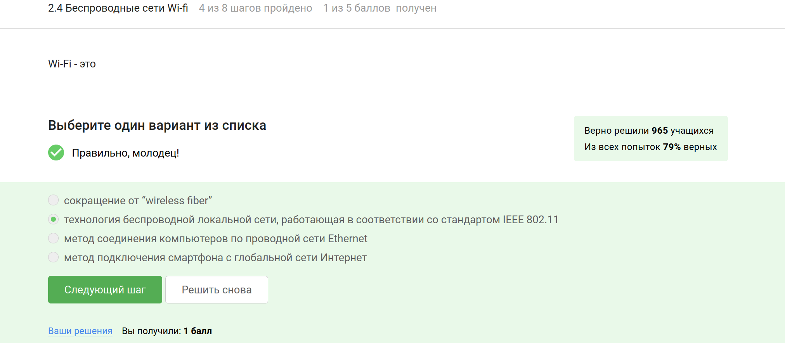{#fig:018 width=100%}

Протокол Wi-Fi работает на канальном уровне модели OSI, обеспечивая беспроводную передачу данных между устройствами в локальной сети, а также отвечает за доступ к среде передачи и управление потоком данных (рис. [-@fig:019]).

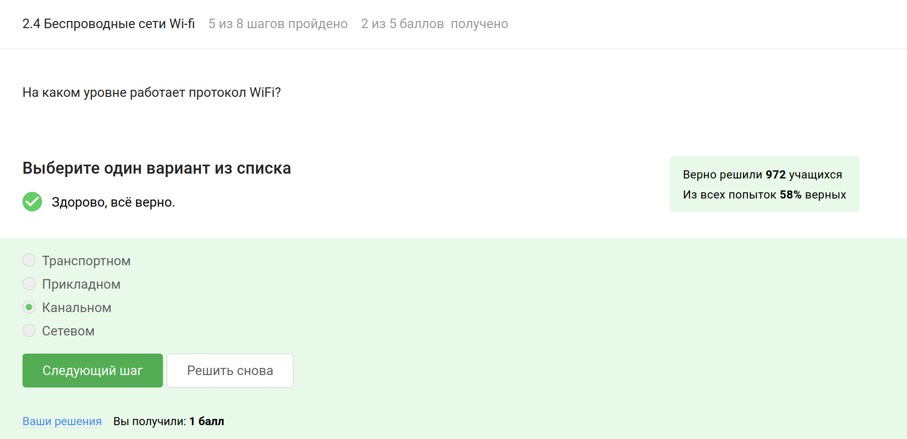{#fig:019 width=100%}

WEP является устаревшим и небезопасным методом шифрования для Wi-Fi, поскольку его алгоритмы легко поддаются взлому (рис. [-@fig:020]).

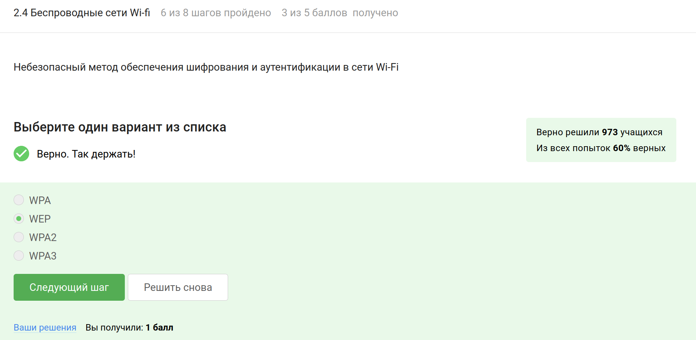{#fig:020 width=100%}

При использовании современных протоколов безопасности Wi-Fi, таких как WPA2 или WPA3, данные шифруются после того, как устройства проходят процесс аутентификации, что обеспечивает конфиденциальность и защиту информации. (рис. [-@fig:021]).

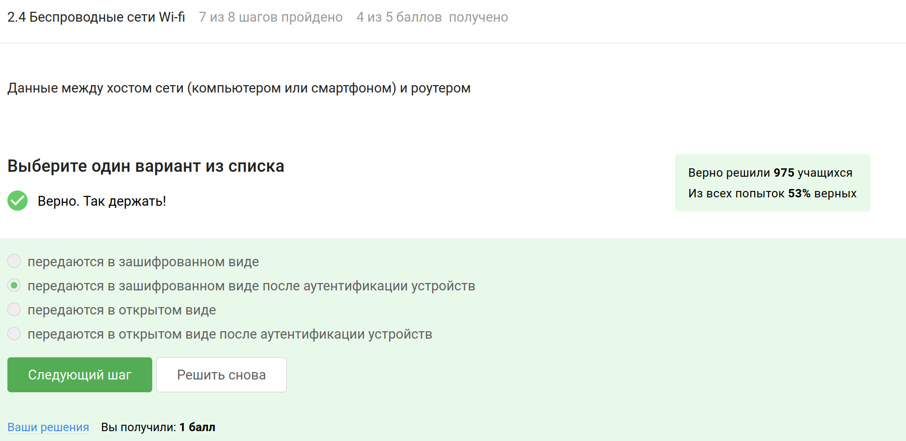{#fig:021 width=100%}

Этот метод аутентификации предназначен для домашних и небольших офисных сетей, обеспечивая простоту настройки и использования с одним паролем для доступа. (рис. [-@fig:022]).

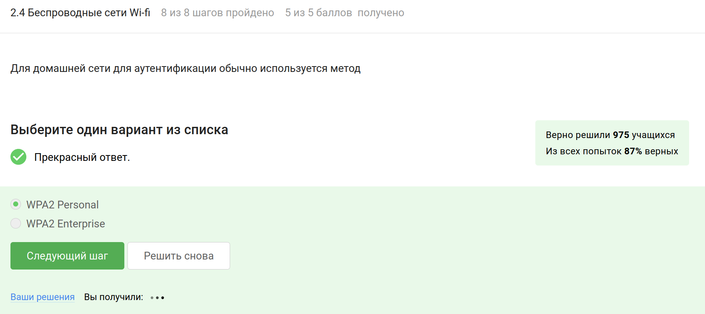{#fig:022 width=100%}

# Выводы

Я прошла первый этап "Безопасность в сети" внешнего курса "Основы кибербезопасности" и изучила работу Интернета и базовых сетевых протоколов
