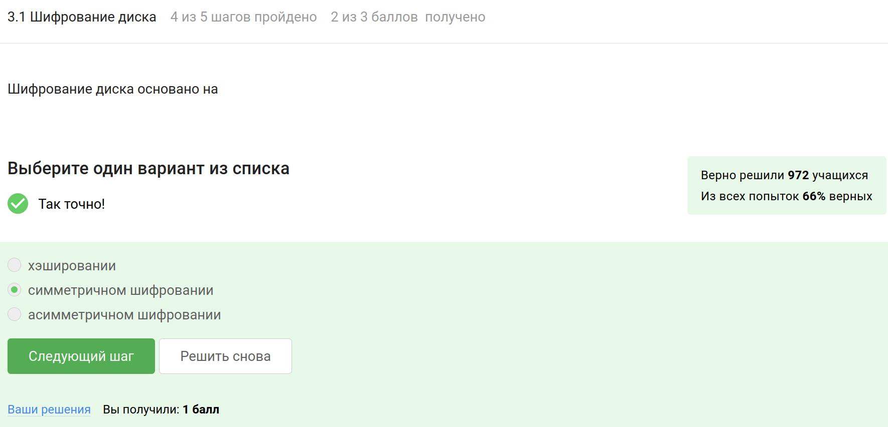
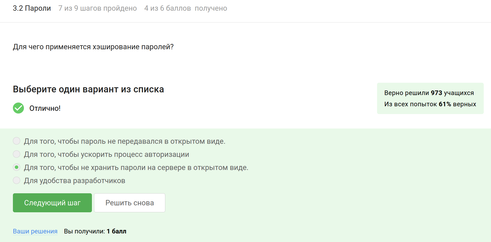

---
## Front matter
lang: ru-RU
title: Внешний курс «‎Основы кибербезопасности»
subtitle: Защита ПК/телефона
author:
  - Карпова Е.А.
institute:
  - Российский университет дружбы народов, Москва, Россия
date: 8.05.2025

## i18n babel
babel-lang: russian
babel-otherlangs: english

## Formatting pdf
toc: false
toc-title: Содержание
slide_level: 2
aspectratio: 169
section-titles: true
theme: metropolis
header-includes:
 - \metroset{progressbar=frametitle,sectionpage=progressbar,numbering=fraction}
 - '\makeatletter'
 - '\beamer@ignorenonframefalse'
 - '\makeatother'
---
# Информация

## Докладчик

:::::::::::::: {.columns align=center}
::: {.column width="70%"}

  * Карпова Есения Алексеевна
  * Студентка НКАбд-02-23
  * ФФМиЕН
  * Российский университет дружбы народов
  * [1132236008@pfur.ru](mailto:1132236008@pfur.ru)
  * <https://github.com/eakarpova>

:::
::: {.column width="30%"}

:::
::::::::::::::
# Вводная часть

## Цели и задачи

- Как шифруются носители информации и зачем это нужно

- Как пароли хранятся на серверах

- Какие типы фишинговых рассылок бывают и как их можно избежать

- Как достигается безопасность сообщений в современных мессенджерах

# Выполнение внешнего курса

## Шифрование диска

### Шифрование диска основано на

{#fig:002 width=100%}

## Пароли

### Для чего применяется хэширование паролей?

{#fig:007 width=100%}

## Фишинг

### Какие из следующих ссылок являются фишинговыми?

{#fig:010 width=100%}

## Вирусы

### Вирус-троян

{#fig:013 width=100%}

## Безопасность мессенджеров

### Суть сквозного шифрования состоит в

{#fig:015 width=100%}

# Выводы

Я прошла второй этап "Защита ПК/телефона" внешнего курса "Основы кибербезопасности" и изучила, как шифруются носители информации и зачем это нужно.
