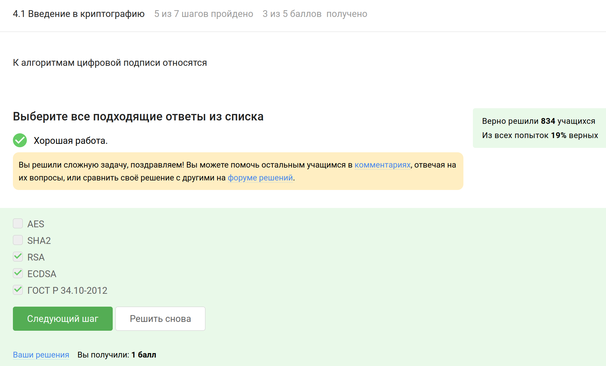

---
## Front matter
lang: ru-RU
title: Внешний курс «‎Основы кибербезопасности»
subtitle: Криптография на практике
author:
  - Карпова Е.А.
institute:
  - Российский университет дружбы народов, Москва, Россия
date: 8.05.2025

## i18n babel
babel-lang: russian
babel-otherlangs: english

## Formatting pdf
toc: false
toc-title: Содержание
slide_level: 2
aspectratio: 169
section-titles: true
theme: metropolis
header-includes:
 - \metroset{progressbar=frametitle,sectionpage=progressbar,numbering=fraction}
 - '\makeatletter'
 - '\beamer@ignorenonframefalse'
 - '\makeatother'
---
# Информация

## Докладчик

:::::::::::::: {.columns align=center}
::: {.column width="70%"}

  * Карпова Есения Алексеевна
  * Студентка НКАбд-02-23
  * ФФМиЕН
  * Российский университет дружбы народов
  * [1132236008@pfur.ru](mailto:1132236008@pfur.ru)
  * <https://github.com/eakarpova>

:::
::: {.column width="30%"}

:::
::::::::::::::

# Вводная часть

## Цели и задачи

- Научиться различать основные криптографические протоколы – симметричное шифрование, аутентификацю, цифровую подпись и хэширование.

- Узнать, как устроены электронные платежи

- Разобраться в системе блокчейн: как она строится, какую задачу в информатике решает

# Выполнение внешнего курса

## Введение в криптографию

### К алгоритмам цифровой подписи относятся

{#fig:003 width=100%}

## Цифровая подпись

### Электронная цифровая подпись не обеспечивает

{#fig:008 width=100%}

## Электронные платежи

### При онлайн платежах сегодня используется

{#fig:013 width=100%}

## Блокчейн

###  Какое свойство криптографической хэш-функции используется в доказательстве работы?

{#fig:014 width=100%}

# Выводы

Я прошла третий этап "Криптография на практике" внешнего курса "Основы кибербезопасности" и научилась различать основные криптографические протоколы – симметричное шифрование, аутентификацю, цифровую подпись и хэширование

