---
## Front matter
lang: ru-RU
title: Лабораторная работа №1
subtitle: Установка и конфигурация операционной системы на виртуальную машину
author:
  - Карпова Е.А.
institute:
  - Российский университет дружбы народов, Москва, Россия
  - Объединённый институт ядерных исследований, Дубна, Россия
date: 15.02.2025

## i18n babel
babel-lang: russian
babel-otherlangs: english

## Formatting pdf
toc: false
toc-title: Содержание
slide_level: 2
aspectratio: 169
section-titles: true
theme: metropolis
header-includes:
 - \metroset{progressbar=frametitle,sectionpage=progressbar,numbering=fraction}
 - '\makeatletter'
 - '\beamer@ignorenonframefalse'
 - '\makeatother'
---

---

# Информация

## Докладчик

:::::::::::::: {.columns align=center}
::: {.column width="70%"}

  * Карпова Есения Алексеевна
  * Студентка НКАбд-02-23
  * ФФМиЕН
  * Российский университет дружбы народов
  * [1132236008@pfur.ru](mailto:1132236008@pfur.ru)
  * <https://github.com/eakarpova>

:::
::: {.column width="30%"}

:::
::::::::::::::

# Вводная часть

## Цели и задачи

- Приобрести практические навыки установки операционной системы на ВМ
- Настройки минимально необходимых сервисов
- Выполнение домашней работы

# Установка и настройка виртуальной машины

## Создание виртуальной машины

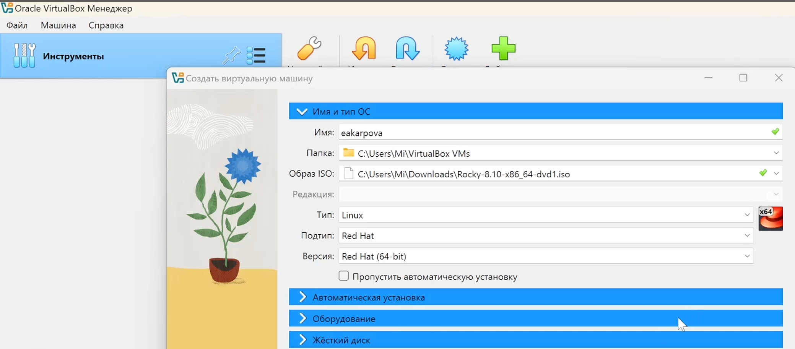

## Задание настроек ВМ

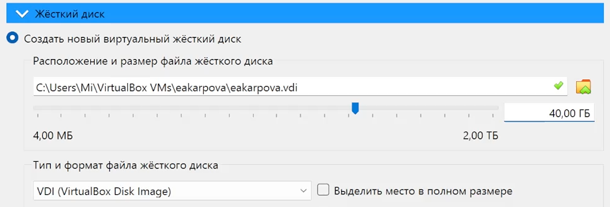

## Окно с созданной ВМ

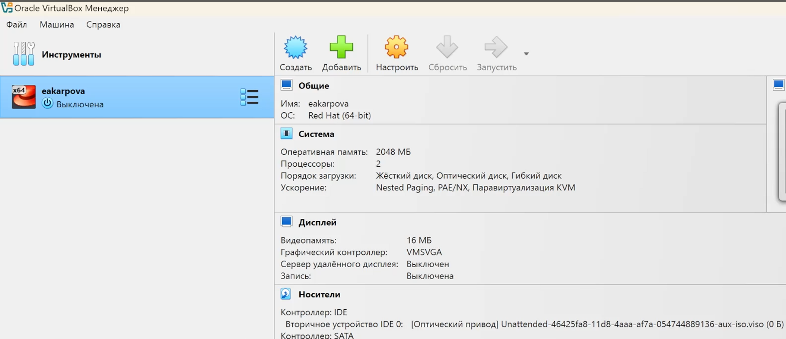

## Добавление образа ОС

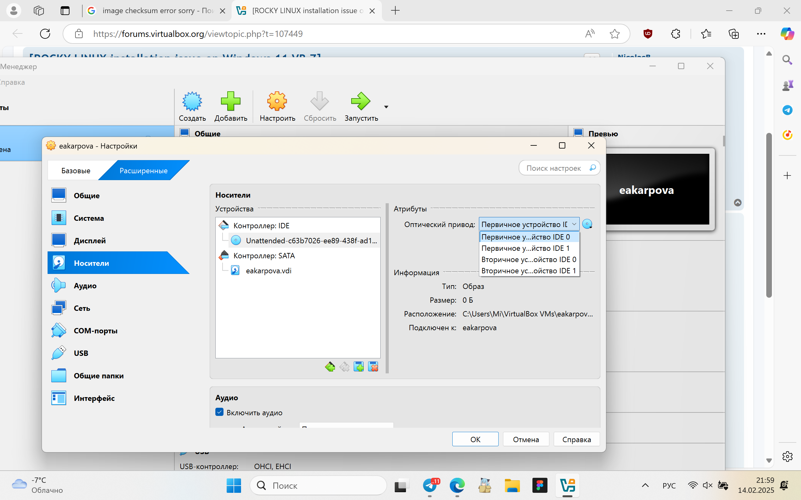

## Окно настроек ОС

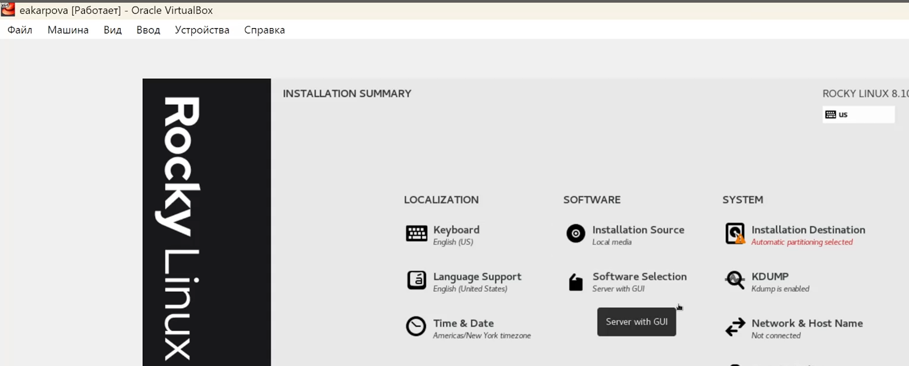

## Место установки ОС]

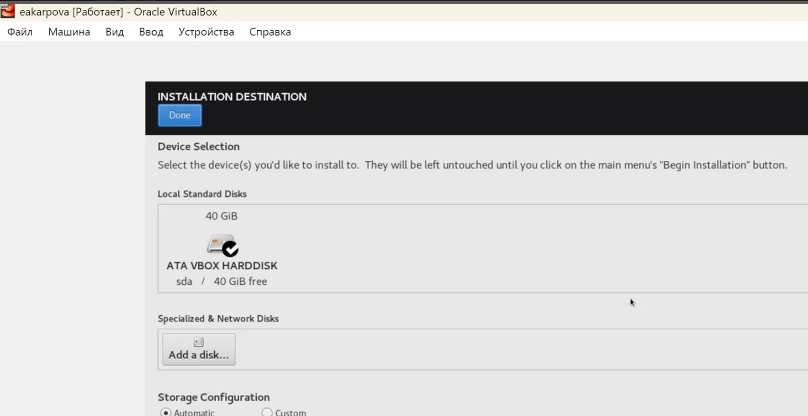

## Выбор программ

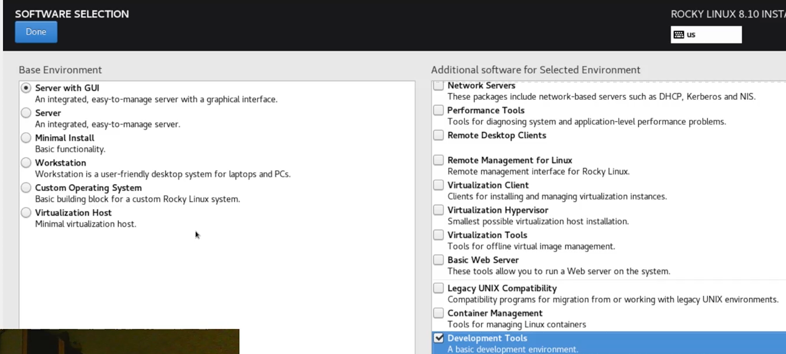

## Образ диска дополнений

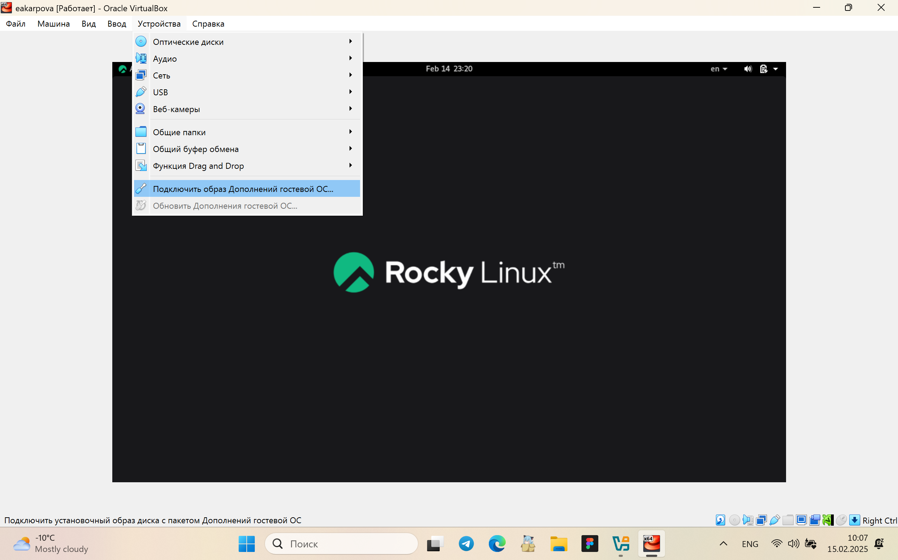

## Загрузка дополнений

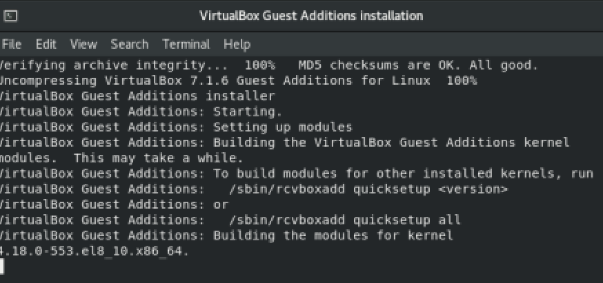

# Домашнее задание

## Версия ядра Linux

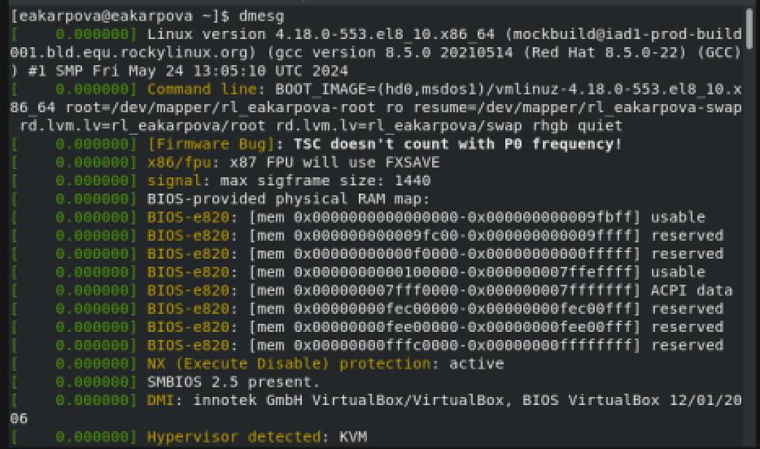

## Частота процессора

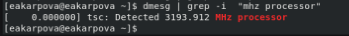

## Модель процессора

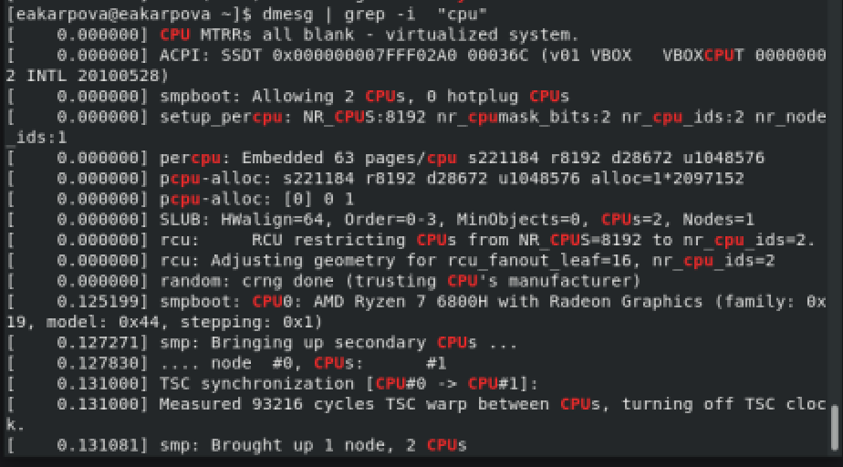

## Объем ОП

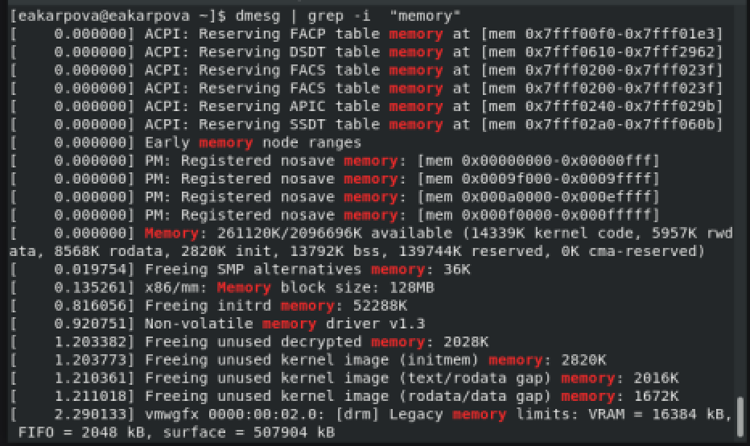

## Тип файловой системы и гипервизора

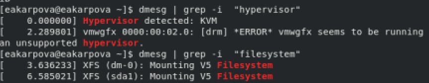

## Результаты

В ходе лабораторной работы я приобрела практические навыки установки операционной системы на виртуальную машину, настройки минимально необходимых для дальнейшей работы сервисов
