---
## Front matter
title: "Лабораторная работа №1"
subtitle: "Установка и конфигурация операционной системы на виртуальную машину"
author: "Карпова Есения Алексеевна"

## Generic otions
lang: ru-RU
toc-title: "Содержание"

## Bibliography
bibliography: bib/cite.bib
csl: pandoc/csl/gost-r-7-0-5-2008-numeric.csl

## Pdf output format
toc: true # Table of contents
toc-depth: 2
lof: true # List of figures
lot: true # List of tables
fontsize: 12pt
linestretch: 1.5
papersize: a4
documentclass: scrreprt
## I18n polyglossia
polyglossia-lang:
  name: russian
  options:
	- spelling=modern
	- babelshorthands=true
polyglossia-otherlangs:
  name: english
## I18n babel
babel-lang: russian
babel-otherlangs: english
## Fonts
mainfont: IBM Plex Serif
romanfont: IBM Plex Serif
sansfont: IBM Plex Sans
monofont: IBM Plex Mono
mathfont: STIX Two Math
mainfontoptions: Ligatures=Common,Ligatures=TeX,Scale=0.94
romanfontoptions: Ligatures=Common,Ligatures=TeX,Scale=0.94
sansfontoptions: Ligatures=Common,Ligatures=TeX,Scale=MatchLowercase,Scale=0.94
monofontoptions: Scale=MatchLowercase,Scale=0.94,FakeStretch=0.9
mathfontoptions:
## Biblatex
biblatex: true
biblio-style: "gost-numeric"
biblatexoptions:
  - parentracker=true
  - backend=biber
  - hyperref=auto
  - language=auto
  - autolang=other*
  - citestyle=gost-numeric
## Pandoc-crossref LaTeX customization
figureTitle: "Рис."
tableTitle: "Таблица"
listingTitle: "Листинг"
lofTitle: "Список иллюстраций"
lotTitle: "Список таблиц"
lolTitle: "Листинги"
## Misc options
indent: true
header-includes:
  - \usepackage{indentfirst}
  - \usepackage{float} # keep figures where there are in the text
  - \floatplacement{figure}{H} # keep figures where there are in the text
---

# Цель работы

Целью данной работы является приобретение практических навыков установки операционной системы на виртуальную машину, настройки минимально необходимых для дальнейшей работы сервисов.

# Задания

1. Установка и настройка виртуальной машины
2. Домашнее задание
3. Контрольные вопросы

# Теоретическое введение

Виртуальная машина — это программная или аппаратная система, эмулирующая аппаратное обеспечение и позволяющая запускать операционные системы и приложения в изолированных средах. Один из популярных инструментов виртуализации — Oracle VM VirtualBox, поддерживающий различные операционные системы, включая Windows, Linux, macOS и другие. Виртуальные машины дают возможность работать с несколькими операционными системами на одном физическом устройстве, эффективно распределяя ресурсы.

Операционная система управляет ресурсами компьютера и позволяет запускать прикладные программы. На виртуальной машине она функционирует так же, как и на физическом компьютере, но с учетом особенностей виртуализации. Для Linux существует множество дистрибутивов, таких как Ubuntu, Fedora, Debian и Rocky Linux. Последний представляет собой дистрибутив, ориентированный на корпоративное использование и поддерживающий долгосрочную стабильность, что делает его популярным выбором для серверных решений и в облачных средах. Rocky Linux является продолжением CentOS, обеспечивая совместимость с Red Hat Enterprise Linux (RHEL) и предлагая открытый и свободно доступный вариант для бизнеса и разработки.

# Выполнение лабораторной работы

## Установка и настройка виртуальной машины

Я выполняю лабораторную работу на своей технике, поэтому располагаю файл с виртуальной машиной в удобной для меня директории, предварительно скачав образ операционной системы Rocky с официального сайта. Перейдя в программу, я перехожу в вкладу "Машина" и выбираю "Создать". Указываю имя виртуальной машины, тип
операционной системы — Linux, RedHat (64-bit) (рис. [-@fig:001]).

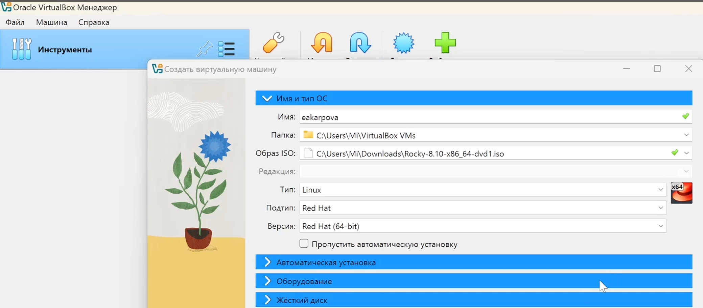{#fig:001 width=100%}

Указываю размер основной памяти виртуальной машины — 2048 МБ, задаю конфигурацию жёсткого диска — загрузочный (VDI - динамический виртуальный диск) и размер диска — 40 ГБ. (рис. [-@fig:002]).

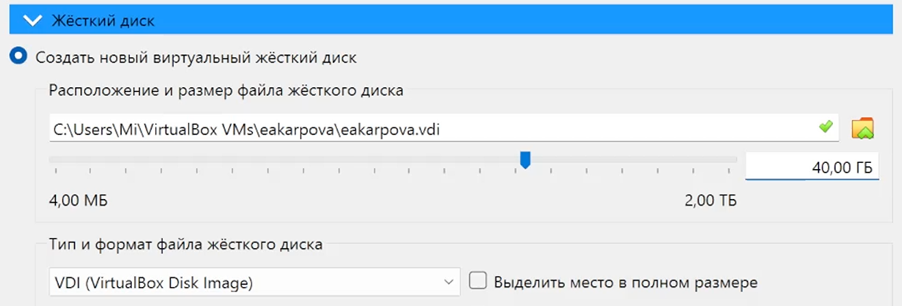{#fig:002 width=100%}

После того, как я задала основные настройки ВМ, у меня открылось окно, где справа расположена созданная ВМ, а также перечислены ее характеристики (рис. [-@fig:003]).

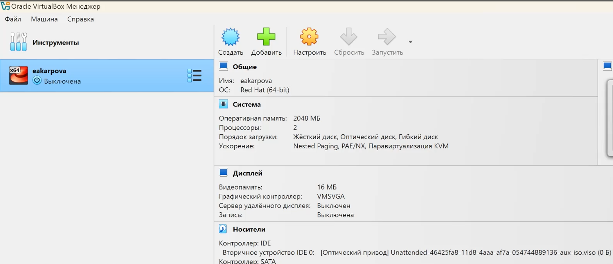{#fig:003 width=100%}

Добавляю новый привод оптических дисков и выбераю образ
операционной системы Rocky (рис. [-@fig:004]).

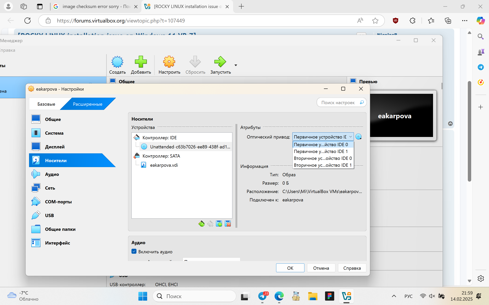{#fig:004 width=100%}

Запускаю виртуальную машину, выбераю English в качестве
языка интерфейса и перехожу к настройкам установки опера-
ционной системы  (рис. [-@fig:005]).

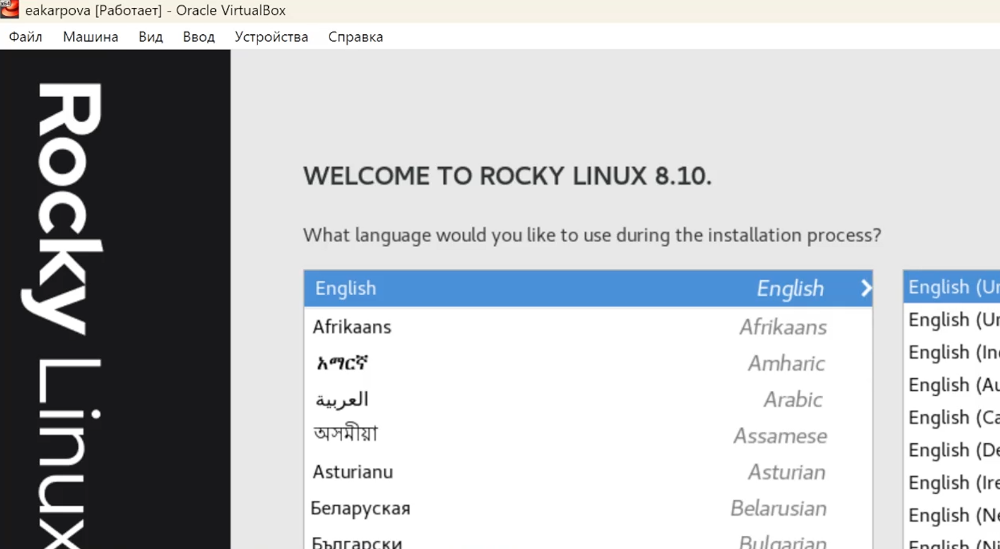{#fig:005 width=100%}

В открывшемся окне приступаю к настройкам операционной системы. Включаю сетевое соединение и в качестве имени узла указываю eakarpova.localdomain (рис. [-@fig:006]).

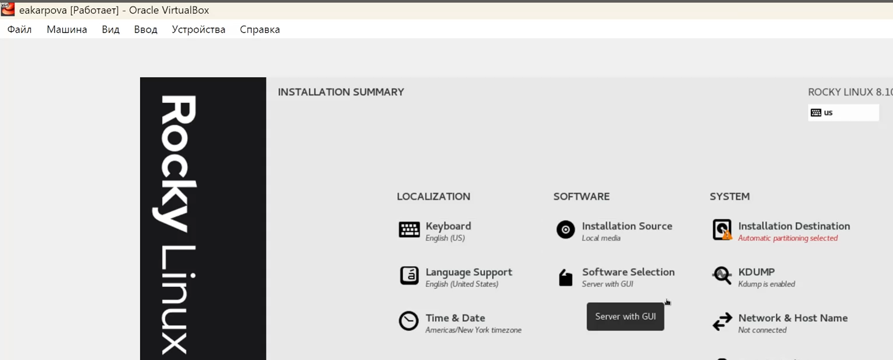{#fig:006 width=100%}

Место установки ОС оставляю без изменения. Отключаю KDUMP. (рис. [-@fig:007]).

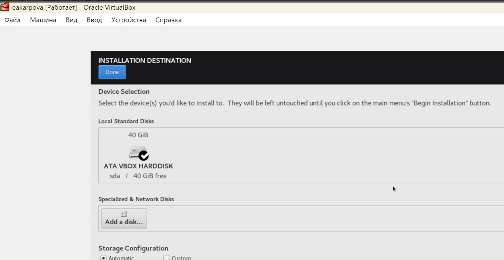{#fig:007 width=100%}

В разделе выбора программ укажите в качестве базового окружения
Server with GUI , а в качестве дополнения — Development Tools (рис. [-@fig:008]).

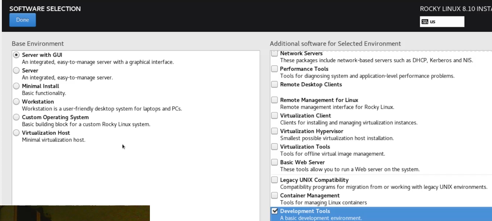{#fig:008 width=100%}

Корректирую часовой пояс, раскладку клавиатуры (рис. [-@fig:009]).

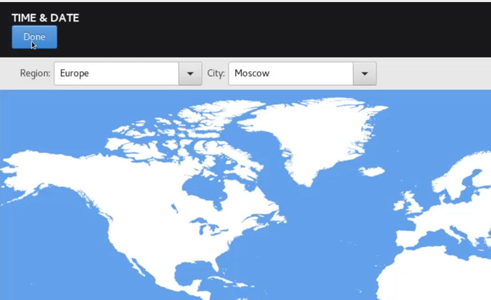{#fig:009 width=100%}

Установливаю пароль для root и пользователя с правами администратора. После завершения установки операционной системы корректно перезапускаю виртуальную машину и при запросе примаю условия лицензии. Затем вхожу в ОС под заданной учётной записью. В меню "Устройства виртуальной машины" подключаю образ диска дополнений гостевой ОС (рис. [-@fig:010]).

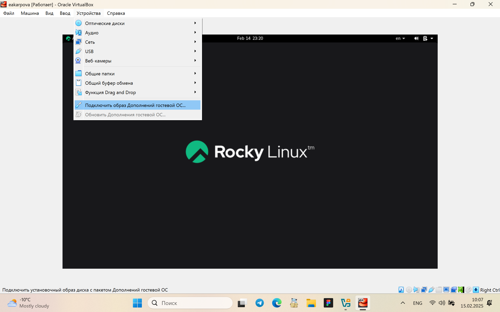{#fig:010 width=100%}

После загрузки дополнений нажмаю Enter и корректно перезагружаю виртуальную машину. (рис. [-@fig:011]).

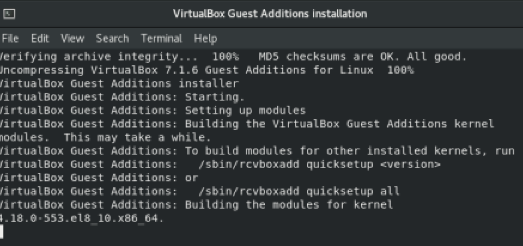{#fig:011 width=100%}

## Установка и настройка виртуальной машины

С помощью конструкции с grep:

dmesg | grep -i "то, что ищем"

Получаю  следующую информацию:

1. Версия ядра Linux (Linux version).

Команда: dsmeg (рис. [-@fig:012]).

Информация выводится в первой строке, поэтому я не использовала дополнительные утилиты.

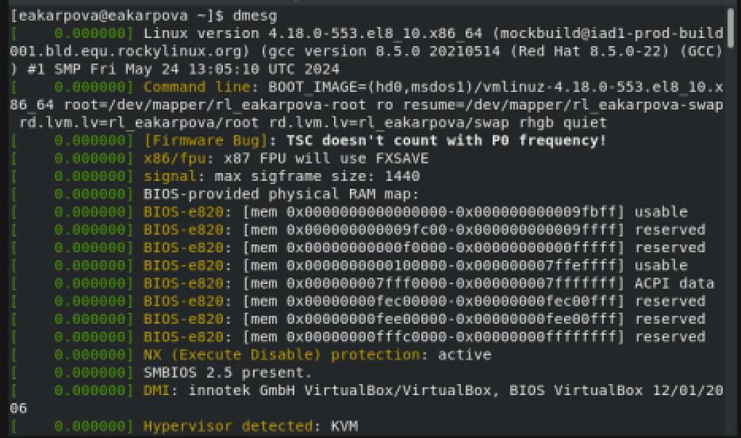{#fig:012 width=100%}

2. Частота процессора (Detected Mhz processor)

Команда: dmesg | grep -i "mhz processor" (рис. [-@fig:013]).

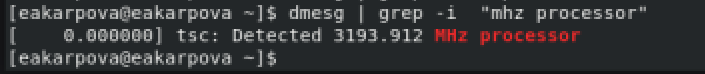{#fig:013 width=100%}

3. Модель процессора (CPU0)

Команда: dmesg | grep -i "cpu" (рис. [-@fig:014]).

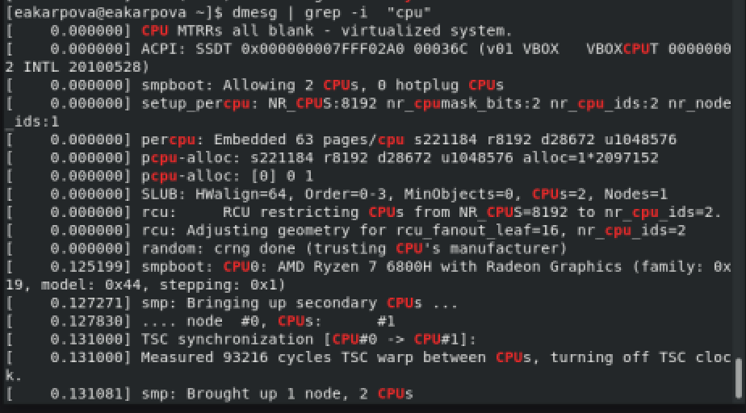{#fig:014 width=100%}

4. Объем доступной оперативной памяти (Memory available)

Команда: dmesg | grep -i "memory" (рис. [-@fig:015]).

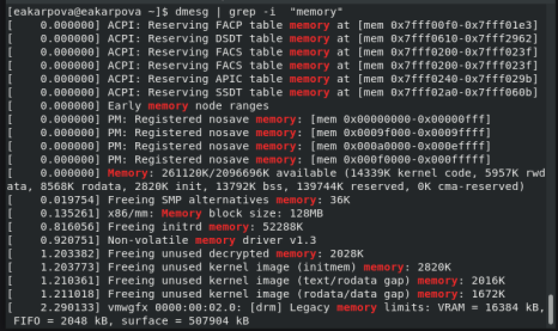{#fig:015 width=100%}

5. Тип обнаруженного гипервизора (Hypervisor detected).
Команда: dmesg | grep -i "hypervisor" (рис. [-@fig:016]).

6. Тип файловой системы корневого раздела
Команда: dmesg | grep -i "filesystem" (рис. [-@fig:016]).

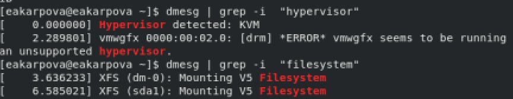{#fig:016 width=100%}

## Ответы на контрольные вопросы

1. Учётная запись пользователя содержит:

1) Имя пользователя (логин) – идентификатор для входа в систему

2) Идентификатор пользователя (UID) – уникальный числовой идентификатор пользователя

3) Идентификатор группы (GID) – идентификатор основной группы пользователя

4) Домашний каталог – путь к каталогу, предназначенному для хранения личных файлов пользователя

5) Используемая командная оболочка (shell) – интерпретатор команд, используемый пользователем

6) Зашифрованный пароль – для аутентификации пользователя

2. Команды терминала и примеры их использования:

    Получение справки по команде:

        *   `man <команда>` – отображает руководство пользователя для указанной команды (пример: `man ls`).
        *   `<команда> --help` - отображает краткую информацию об использовании команды.

    Перемещение по файловой системе:

        *   `cd <каталог>` – переход в указанный каталог (пример: `cd /home/user/documents`).
        *   `cd ..` – переход в родительский каталог.
        *   `cd` – переход в домашний каталог пользователя.

    Просмотр содержимого каталога:

        *   `ls` – вывод списка файлов и подкаталогов в текущем каталоге.
        *   `ls -l` – вывод подробной информации о файлах и подкаталогах (права, размер, дата изменения).
        *   `ls -a` - отображает все файлы, включая скрытые.

    Определение объёма каталога:

        *   `du -sh <каталог>` – вывод объёма указанного каталога в человеко-читаемом формате (пример: `du -sh /var/log`).

    Создание/удаление каталогов/файлов:

        *   `mkdir <каталог>` – создание нового каталога (пример: `mkdir new_directory`).
        *   `rmdir <каталог>` – удаление пустого каталога (пример: `rmdir empty_directory`).
        *   `touch <файл>` – создание нового файла (пример: `touch new_file.txt`).
        *   `rm <файл>` – удаление файла (пример: `rm my_file.txt`).
        *   `rm -r <каталог>` – удаление каталога и всего его содержимого (пример: `rm -r old_directory`).

    Задание прав доступа к файлам/каталогам:

        *   `chmod <права> <файл>` – изменение прав доступа к файлу или каталогу (пример: `chmod 755 script.sh`).
        *   `chmod +x <файл>` - сделать файл исполняемым.

    Просмотр истории команд:

        *   `history` – вывод списка ранее выполненных команд.

3.  Файловая система – это метод организации хранения данных на диске, определяющий структуру и атрибуты файлов и каталогов.

    Примеры файловых систем:

    *   ext4: Наиболее распространённая файловая система в Linux, характеризуется надёжностью и производительностью.
    *   NTFS: Стандартная файловая система для операционных систем Windows, поддерживает расширенные атрибуты и права доступа.
    *   Btrfs: Современная файловая система с поддержкой снапшотов, сжатия данных и других продвинутых функций.

4.  Список смонтированных файловых систем можно получить с помощью команды `mount`. Эта команда отображает информацию о каждой примонтированной файловой системе, включая её тип и точку монтирования.  Также, информация о монтировании файловых систем хранится в файле `/etc/fstab`.

5.  Для удаления зависшего процесса необходимо сначала определить его PID (идентификатор процесса). Это можно сделать с помощью команд `ps aux | grep <имя_процесса>` или `top`. Затем можно использовать команду `kill`:

    *   `kill <PID>` – отправка сигнала SIGTERM для запроса корректного завершения процесса.
    *   `kill -9 <PID>` – отправка сигнала SIGKILL для принудительного завершения процесса (следует использовать только в крайних случаях).

# Выводы

В ходе лабораторной работы я приобрела практические навыки установки операционной системы на виртуальную машину, настройки минимально необходимых для дальнейшей работы сервисов

