---
## Front matter
lang: ru-RU
title: Лабораторная работа №2
subtitle: Дискреционное разграничение прав в Linux. Основные атрибуты
author:
  - Карпова Е.А.
institute:
  - Российский университет дружбы народов, Москва, Россия
date: 26.02.2025

## i18n babel
babel-lang: russian
babel-otherlangs: english

## Formatting pdf
toc: false
toc-title: Содержание
slide_level: 2
aspectratio: 169
section-titles: true
theme: metropolis
header-includes:
 - \metroset{progressbar=frametitle,sectionpage=progressbar,numbering=fraction}
 - '\makeatletter'
 - '\beamer@ignorenonframefalse'
 - '\makeatother'
---

# Информация

## Докладчик

:::::::::::::: {.columns align=center}
::: {.column width="70%"}

  * Карпова Есения Алексеевна
  * Студентка НКАбд-02-23
  * ФФМиЕН
  * Российский университет дружбы народов
  * [1132236008@pfur.ru](mailto:1132236008@pfur.ru)
  * <https://github.com/eakarpova>

:::
::: {.column width="30%"}

:::
::::::::::::::

# Вводная часть

## Цели и задачи

1. Ознакомление с основными командами терминала

2. Заполнение таблицы «Установленные права и разрешённые действия»

3. Заполнение таблицы «Минимальные права для совершения операций»

# Ознакомление с основными командами терминала

## Создание учетной записи guest

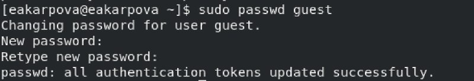

## Вход в систему от имени пользователя guest

## Команда pwd

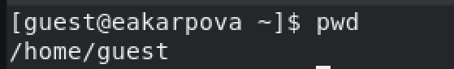

## Команда whoami

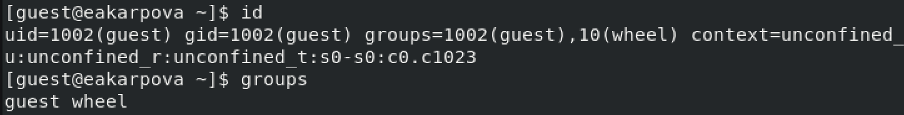

## Команды id и groups

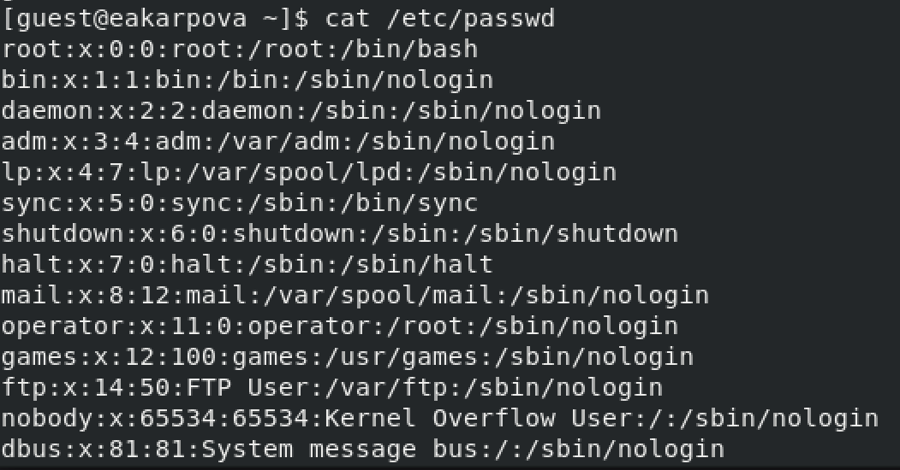

## Нахождение uid и gid

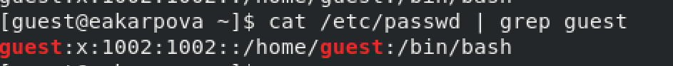

## Команда ls

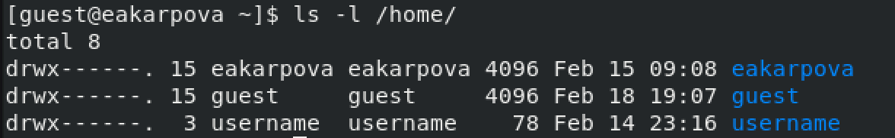

## Проверка расширенных атрибутов

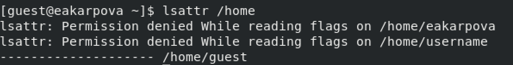

## Определение прав доступа

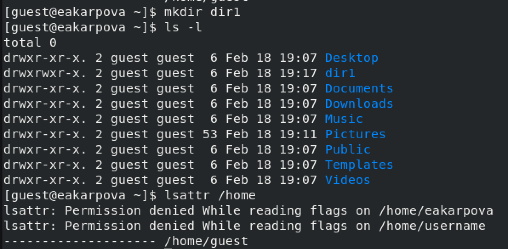

## Команда chmod

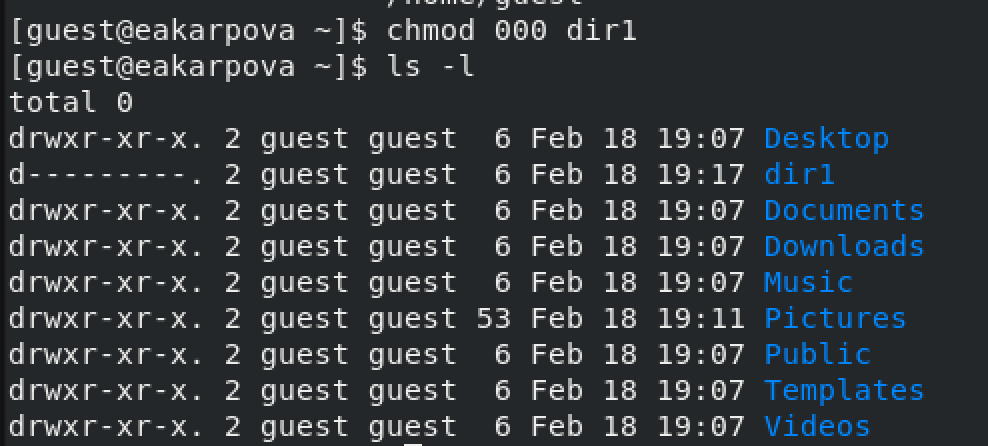

## Создание файла

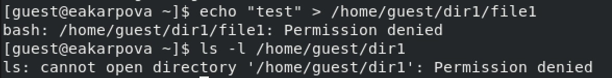

## Заполнение таблицы

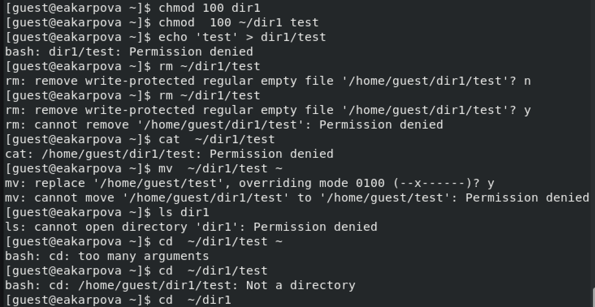

## Результаты

В ходе лабораторной работы я получила практические навыки работы в консоли с атрибутами файлов, закрепила теоретические основы дискреционного разграничения доступа в современных системах с открытым кодом на базе ОС Linux

