---
## Front matter
title: "Лабораторная работа №2"
subtitle: "Дискреционное разграничение прав в Linux. Основные атрибуты"
author: "Карпова Есения Алексеевна"

## Generic otions
lang: ru-RU
toc-title: "Содержание"

## Bibliography
bibliography: bib/cite.bib
csl: pandoc/csl/gost-r-7-0-5-2008-numeric.csl

## Pdf output format
toc: true # Table of contents
toc-depth: 2
lof: true # List of figures
lot: true # List of tables
fontsize: 12pt
linestretch: 1.5
papersize: a4
documentclass: scrreprt
## I18n polyglossia
polyglossia-lang:
  name: russian
  options:
	- spelling=modern
	- babelshorthands=true
polyglossia-otherlangs:
  name: english
## I18n babel
babel-lang: russian
babel-otherlangs: english
## Fonts
mainfont: IBM Plex Serif
romanfont: IBM Plex Serif
sansfont: IBM Plex Sans
monofont: IBM Plex Mono
mathfont: STIX Two Math
mainfontoptions: Ligatures=Common,Ligatures=TeX,Scale=0.94
romanfontoptions: Ligatures=Common,Ligatures=TeX,Scale=0.94
sansfontoptions: Ligatures=Common,Ligatures=TeX,Scale=MatchLowercase,Scale=0.94
monofontoptions: Scale=MatchLowercase,Scale=0.94,FakeStretch=0.9
mathfontoptions:
## Biblatex
biblatex: true
biblio-style: "gost-numeric"
biblatexoptions:
  - parentracker=true
  - backend=biber
  - hyperref=auto
  - language=auto
  - autolang=other*
  - citestyle=gost-numeric
## Pandoc-crossref LaTeX customization
figureTitle: "Рис."
tableTitle: "Таблица"
listingTitle: "Листинг"
lofTitle: "Список иллюстраций"
lotTitle: "Список таблиц"
lolTitle: "Листинги"
## Misc options
indent: true
header-includes:
  - \usepackage{indentfirst}
  - \usepackage{float} # keep figures where there are in the text
  - \floatplacement{figure}{H} # keep figures where there are in the text
---

# Цель работы

Получение практических навыков работы в консоли с атрибутами фай-
лов, закрепление теоретических основ дискреционного разграничения до-
ступа в современных системах с открытым кодом на базе ОС Linux

# Задания

1. Ознакомление с основными командами терминала

2. Заполнение таблицы «Установленные права и разрешённые действия»

3. Заполнение таблицы «Минимальные права для совершения операций»

# Теоретическое введение

Права доступа в Linux определяют, кто и каким образом может взаимодействовать с файлами и директориями в системе. Каждый файл и директория имеют ассоциированные с ними права, которые указывают на возможность чтения, записи и выполнения. Эти права назначаются для трех категорий пользователей: владельца файла, группы пользователей и всех остальных пользователей.

Система управления правами доступа в Linux основана на трех основных типах разрешений: "r" (чтение), "w" (запись) и "x" (выполнение). Владельцы файлов могут изменять права доступа с помощью команд, таких как chmod, а также настраивать владельца и группу через команды chown и chgrp. Это позволяет администраторам систем эффективно управлять безопасностью и конфиденциальностью данных.

Правильная настройка прав доступа критически важна для защиты систем от несанкционированного доступа и обеспечения безопасности пользовательских данных. Неправильно установленное разрешение может привести к компрометации системы, поэтому важно по умолчанию применять наименее привилегированные разрешения к файлам и директориям.

# Выполнение лабораторной работы

## Ознакомление с основными командами терминала

1. Создаю учетную запись guest и меняю пароль (рис. [-@fig:001]).

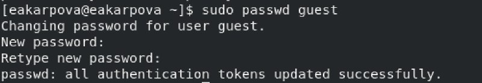{#fig:001 width=100%}

2. Вхожу в систему от имени пользователя guest (рис. [-@fig:002]).

{#fig:002 width=100%}

3. Определяю директорию, в которой нахожусь, командой pwd. Она является домашней директорией. (рис. [-@fig:003]).

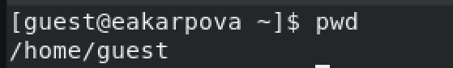{#fig:003 width=100%}

4. Уточняю имя пользователя командой whoami (рис. [-@fig:004]).

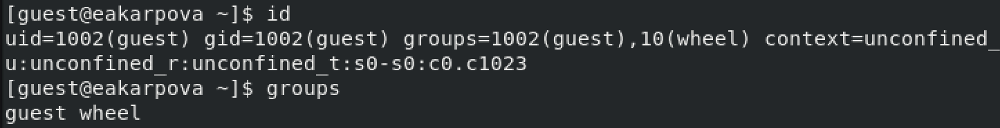{#fig:004 width=100%}

5. Уточняю имя пользователя, его группу, а также группы, куда входит пользователь, командой id. Сравниваю вывод id с выводом команды groups (рис. [-@fig:005]).

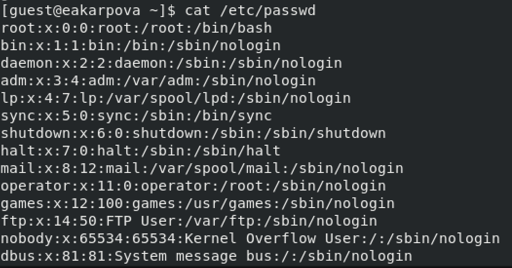{#fig:005 width=100%}

6. Командой cat /etc/passwd просмотриваю файл /etc/passwd (рис. [-@fig:006]).

Так как вывод команды не умещается на одном экране монитора программу grep в качестве фильтра для вывода только строк, содержащих определённые
буквенные сочетания:
cat /etc/passwd | grep guest

Определяю uid и gid пользователя. Они совпадают со значениями, полученные в предыдущих пунктах (1002)

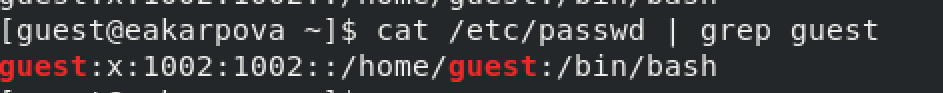{#fig:006 width=100%}

7. Определяю существующие в системе директории командой
ls -l /home/
Мне удалось получить список поддиректорий директории /home. На них установлены права drwx------ (700), то есть только я (пользователь) могу писать и читать указанные файлы (рис. [-@fig:007]).

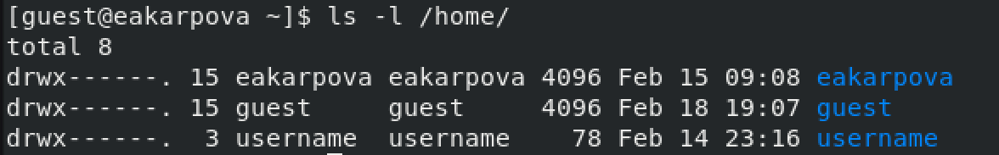{#fig:007 width=100%}

8. Проверяю, какие расширенные атрибуты установлены на поддиректо-
риях, находящихся в директории /home, командой:
lsattr /home
Мне не удалось увидеть расширенные атрибуты директории как своего, так и других пользователей (рис. [-@fig:008]).

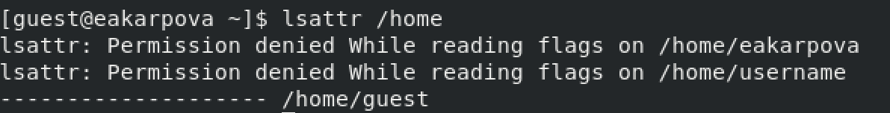{#fig:008 width=100%}

9. Создаю в домашней директории поддиректорию dir1 командой
mkdir dir1
Определяю, какие права доступа и расширенные атрибуты были выставлены на директорию dir1, командами ls -l и lsattr (рис. [-@fig:009]).

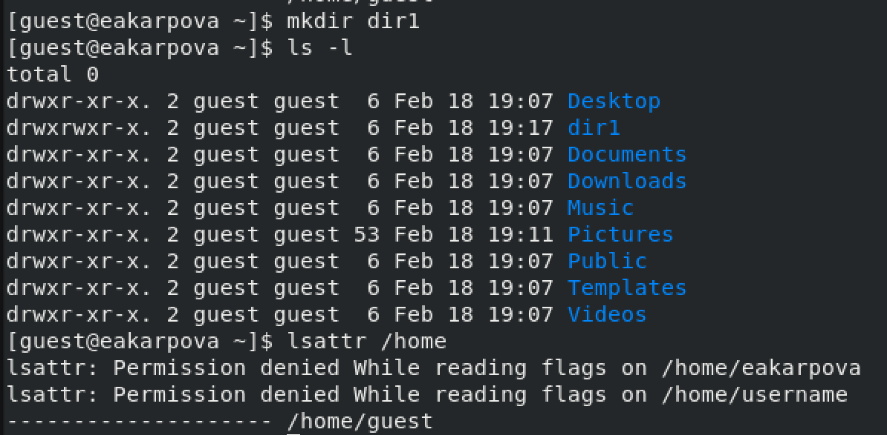{#fig:009 width=100%}

10. Снимаю с директории dir1 все атрибуты командой
chmod 000 dir1
и проверяю её правильность, выполненяя команду
ls -l
(рис. [-@fig:010]).

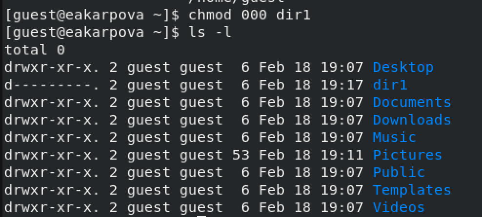{#fig:010 width=100%}

11. Пытаюсь создать в директории dir1 файл file1 командой
echo "test" > /home/guest/dir1/file1
Я получаю сообщение об ошибке, так как в предыдущем пункте поменяла права пользователя для данной директории.
Проверяю, как сообщение об ошибке отразилось на создании файла, с помощью команды
ls -l /home/guest/dir1
(рис. [-@fig:011]).

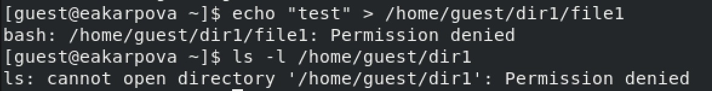{#fig:011 width=100%}

##  Заполнение таблицы «Установленные права и разрешённые действия»

Заполняю таблицу «Установленные права и разрешённые действия», выполняя действия от имени владельца директории, определив опытным путём, какие операции разрешены, а какие нет.
Если операция разрешена, я заношу в таблицу знак «+», если не разрешена, знак «-»
(рис. [-@fig:012]).

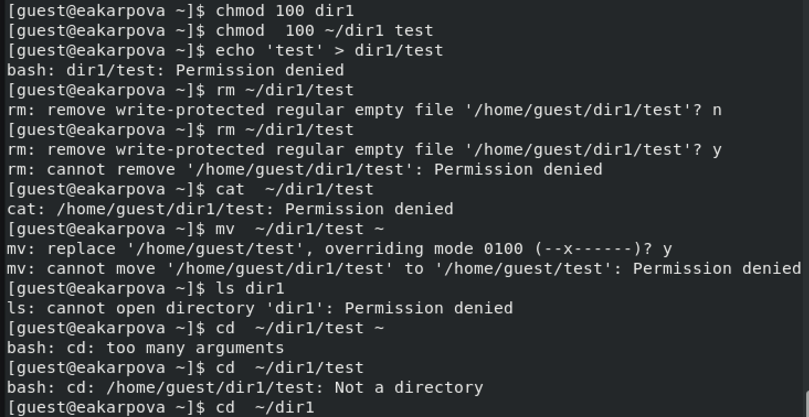{#fig:012 width=100%}

Таблица 2.1 «Установленные права и разрешённые действия»

| | | | | | | | | | |
|-|-|-|-|-|-|-|-|-|-|
|Права директории|Права  файла|Создание  файла|Удаление  файла|Запись  в файл|Чтение  файла|Смена  директории|Просмотр файлов в  директории|Переимено- вание файла|Смена  атрибутов  файла|
|d(000)|(000)| -| -| -| -| -| -| -| -|
|d(000)|(100)| -| -| -| -| -| -| -| -|
|d(000)|(200)| -| -| -| -| -| -| -| -|
|d(000)|(300)| -| -| -| -| -| -| -| -|
|d(000)|(400)| -| -| -| -| -| -| -| -|
|d(000)|(500)| -| -| -| -| -| -| -| -|
|d(000)|(600)| -| -| -| -| -| -| -| -|
|d(000)|(700)| -| -| -| -| -| -| -| -|
|d(100)|(000)| -| -| -| -|+| -| -|+|
|d(100)|(100)| -| -| -| -|+| -| -|+|
|d(100)|(200)| -| -|+| -|+| -| -|+|
|d(100)|(300)| -| -|+| -|+| -| -|+|
|d(100)|(400)| -| -|-|+|+| -| -|+|
|d(100)|(500)| -| -|-|+|+| -| -|+|
|d(100)|(600)| -| -|+|+|+| -| -|+|
|d(100)|(700)| -| -|+|+|+| -| -|+|
|d(200)|(000)| -| -|-|-|-| -| -|-|
|d(200)|(100)| -| -|-|-|-| -| -|-|
|d(200)|(200)| -| -|-|-|-| -| -|-|
|d(200)|(300)| -| -|-|-|-| -| -|-|
|d(200)|(400)| -| -|-|-|-| -| -|-|
|d(200)|(500)| -| -|-|-|-| -| -|-|
|d(200)|(600)| -| -|-|-|-| -| -|-|
|d(200)|(700)| -| -|-|-|-| -| -|-|
|d(300)|(000)|+|+|-|-|+| -|+|+|
|d(300)|(100)|+|+|-|-|+| -|+|+|
|d(300)|(200)|+|+|+|-|+| -|+|+|
|d(300)|(300)|+|+|+|-|+| -|+|+|
|d(300)|(400)|+|+|-|+|+| -|+|+|
|d(300)|(500)|+|+|-|+|+| -|+|+|
|d(300)|(600)|+|+|+|+|+| -|+|+|
|d(300)|(700)|+|+|+|+|+| -|+|+|
|d(400)|(000)|-|-|-|-|-|+|-|-|
|d(400)|(100)|-|-|-|-|-|+|-|-|
|d(400)|(200)|-|-|-|-|-|+|-|-|
|d(400)|(300)|-|-|-|-|-|+|-|-|
|d(400)|(400)|-|-|-|-|-|+|-|-|
|d(400)|(500)|-|-|-|-|-|+|-|-|
|d(400)|(600)|-|-|-|-|-|+|-|-|
|d(400)|(700)|-|-|-|-|-|+|-|-|
|d(500)|(000)|-|-|-|-|+|+|-|+|
|d(500)|(100)|-|-|-|-|+|+|-|+|
|d(500)|(200)|-|-|+|-|+|+|-|+|
|d(500)|(300)|-|-|+|-|+|+|-|+|
|d(500)|(400)|-|-|-|+|+|+|-|+|
|d(500)|(500)|-|-|-|+|+|+|-|+|
|d(500)|(600)|-|-|+|+|+|+|-|+|
|d(500)|(700)|-|-|+|+|+|+|-|+|
|d(600)|(000)|-|-|-|-|-|+|-|-|
|d(600)|(100)|-|-|-|-|-|+|-|-|
|d(600)|(200)|-|-|-|-|-|+|-|-|
|d(600)|(300)|-|-|-|-|-|+|-|-|
|d(600)|(400)|-|-|-|-|-|+|-|-|
|d(600)|(500)|-|-|-|-|-|+|-|-|
|d(600)|(600)|-|-|-|-|-|+|-|-|
|d(600)|(700)|-|-|-|-|-|+|-|-|
|d(700)|(000)|+|+|-|-|+|+|+|+|
|d(700)|(100)|+|+|-|-|+|+|+|+|
|d(700)|(200)|+|+|+|-|+|+|+|+|
|d(700)|(300)|+|+|+|-|+|+|+|+|
|d(700)|(400)|+|+|-|+|+|+|+|+|
|d(700)|(500)|+|+|-|+|+|+|+|+|
|d(700)|(600)|+|+|+|+|+|+|+|+|
|d(700)|(700)|+|+|+|+|+|+|+|+|

##  Заполнение таблицы «Минимальные права для совершения операций»

Таблица 2.2 "Минимальные права для совершения операций"

| | | | | |
|-|-|-|-|-|
|Операция| |Минимальные  права на  директорию| |Минимальные  права на файл|
|Создание файла| |d(300)| |-|
|Удаление файла| |d(300)| |-|
|Чтение файла| |d(100)| |(400)|
|Запись в файл| |d(100)| |(200)|
|Переименование файла| |d(300)| |(000)|
|Создание поддиректории| |d(300)| |-|
|Удаление поддиректории| |d(300)| |-|

# Выводы

В ходе лабораторной работы я получила практические навыки работы в консоли с атрибутами файлов, закрепила теоретические основы дискреционного разграничения доступа в современных системах с открытым кодом на базе ОС Linux
