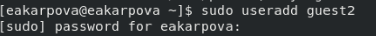
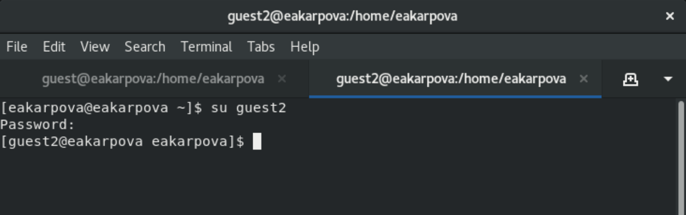
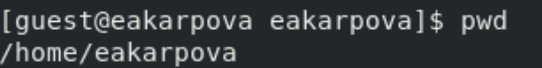
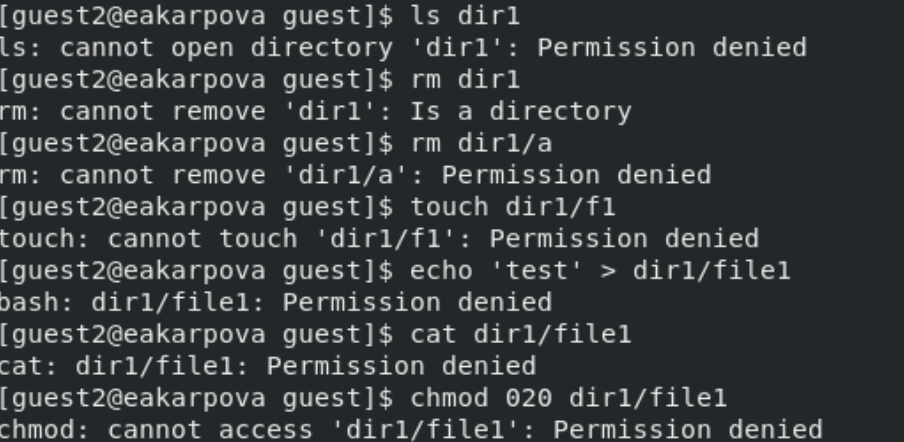

## Front matter
lang: ru-RU
title: Лабораторная работа №3
subtitle: Дискреционное разграничение прав в Linux. Два пользователя.
author:
  - Карпова Е.А.
institute:
  - Российский университет дружбы народов, Москва, Россия
date: 18.03.2025

## i18n babel
babel-lang: russian
babel-otherlangs: english

## Formatting pdf
toc: false
toc-title: Содержание
slide_level: 2
aspectratio: 169
section-titles: true
theme: metropolis
header-includes:
 - \metroset{progressbar=frametitle,sectionpage=progressbar,numbering=fraction}
 - '\makeatletter'
 - '\beamer@ignorenonframefalse'
 - '\makeatother'
---

# Информация

## Докладчик

:::::::::::::: {.columns align=center}
::: {.column width="70%"}

  * Карпова Есения Алексеевна
  * Студентка НКАбд-02-23
  * ФФМиЕН
  * Российский университет дружбы народов
  * [1132236008@pfur.ru](mailto:1132236008@pfur.ru)
  * <https://github.com/eakarpova>

:::
::: {.column width="30%"}

:::
::::::::::::::

# Вводная часть

## Цели и задачи

1. Атрибуты файлов для групп пользователей
2. Установленные права и разрешённые действия для групп
3. Минимальные права для совершения операций от имени пользователей входящих в группу

# Выполнение лабораторной работы

## Создание учетной записи

- `useradd guest`
- `passwd guest2`
- `gpasswd -a guest2 guest`

## Вход в систему с двух разных консолей

## Команда pwd для guest

## Информация о guest

## Пример заполнения таблицы 3.1

# Результаты

В ходе лабораторной работы я получила практические навыки работы в консоли с атрибутами файлов для групп пользователей
