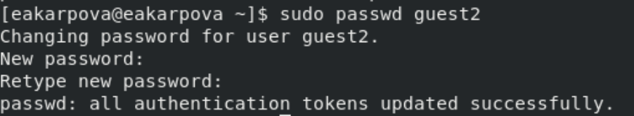
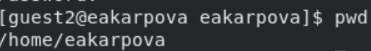
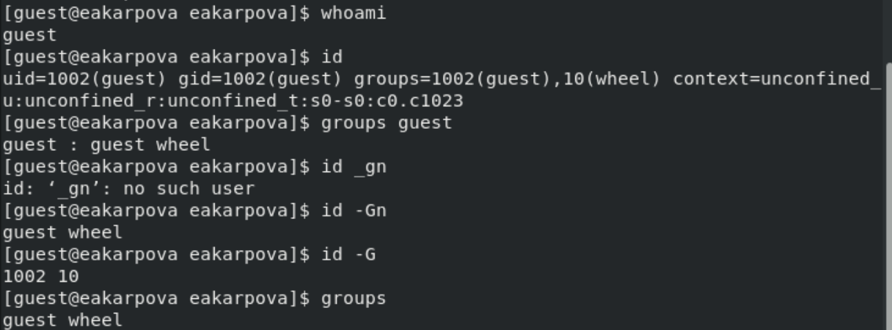
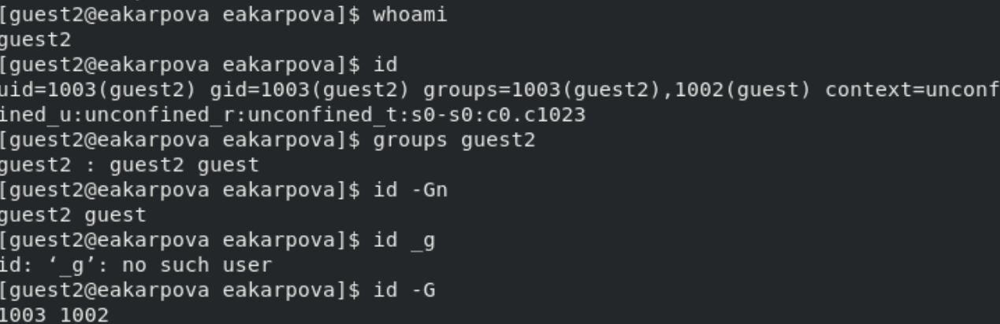
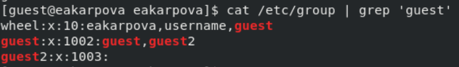
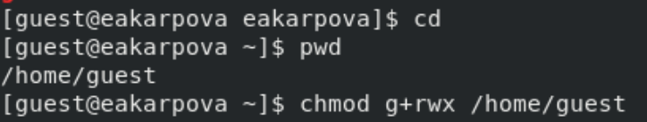
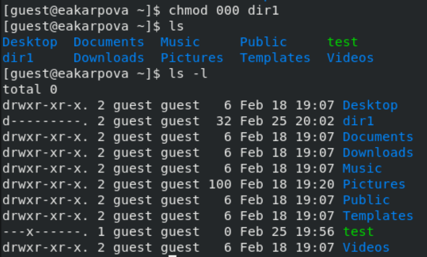

---
## Front matter
title: "Лабораторная работа №3"
subtitle: "Дискреционное разграничение прав в Linux. Два пользователя"
author: "Карпова Есения"

## Generic otions
lang: ru-RU
toc-title: "Содержание"

## Bibliography
bibliography: bib/cite.bib
csl: pandoc/csl/gost-r-7-0-5-2008-numeric.csl

## Pdf output format
toc: true # Table of contents
toc-depth: 2
lof: true # List of figures
lot: true # List of tables
fontsize: 12pt
linestretch: 1.5
papersize: a4
documentclass: scrreprt
## I18n polyglossia
polyglossia-lang:
  name: russian
  options:
	- spelling=modern
	- babelshorthands=true
polyglossia-otherlangs:
  name: english
## I18n babel
babel-lang: russian
babel-otherlangs: english
## Fonts
mainfont: IBM Plex Serif
romanfont: IBM Plex Serif
sansfont: IBM Plex Sans
monofont: IBM Plex Mono
mathfont: STIX Two Math
mainfontoptions: Ligatures=Common,Ligatures=TeX,Scale=0.94
romanfontoptions: Ligatures=Common,Ligatures=TeX,Scale=0.94
sansfontoptions: Ligatures=Common,Ligatures=TeX,Scale=MatchLowercase,Scale=0.94
monofontoptions: Scale=MatchLowercase,Scale=0.94,FakeStretch=0.9
mathfontoptions:
## Biblatex
biblatex: true
biblio-style: "gost-numeric"
biblatexoptions:
  - parentracker=true
  - backend=biber
  - hyperref=auto
  - language=auto
  - autolang=other*
  - citestyle=gost-numeric
## Pandoc-crossref LaTeX customization
figureTitle: "Рис."
tableTitle: "Таблица"
listingTitle: "Листинг"
lofTitle: "Список иллюстраций"
lotTitle: "Список таблиц"
lolTitle: "Листинги"
## Misc options
indent: true
header-includes:
  - \usepackage{indentfirst}
  - \usepackage{float} # keep figures where there are in the text
  - \floatplacement{figure}{H} # keep figures where there are in the text
---

# Цель работы

Получение практических навыков работы в консоли с атрибутами файлов для групп пользователей

# Задание

1. Атрибуты файлов для групп пользователей

2. Установленные права и разрешённые действия для групп

3. Минимальные права для совершения операций от имени пользователей входящих в группу

# Теоретическое введение

Права доступа определяют, какие действия конкретный пользователь может или не может совершать с определенным файлами и каталогами. С помощью разрешений можно создать надежную среду — такую, в которой никто не может поменять содержимое ваших документов или повредить системные файлы.

Группы пользователей Linux кроме стандартных root и users, здесь есть еще пару десятков групп. Это группы, созданные программами, для управления доступом этих программ к общим ресурсам. Каждая группа разрешает чтение или запись определенного файла или каталога системы, тем самым регулируя полномочия пользователя, а следовательно, и процесса, запущенного от этого пользователя. Здесь можно считать, что пользователь - это одно и то же что процесс, потому что у процесса все полномочия пользователя, от которого он запущен.

    daemon - от имени этой группы и пользователя daemon запускаютcя сервисы, которым необходима возможность записи файлов на диск.
    sys - группа открывает доступ к исходникам ядра и файлам - include сохраненным в системе
    sync - позволяет выполнять команду /bin/sync
    games - разрешает играм записывать свои файлы настроек и историю в определенную папку
    man - позволяет добавлять страницы в директорию /var/cache/man
    lp - позволяет использовать устройства параллельных портов
    mail - позволяет записывать данные в почтовые ящики /var/mail/
    proxy - используется прокси серверами, нет доступа записи файлов на диск
    www-data - с этой группой запускается веб-сервер, она дает доступ на запись /var/www, где находятся файлы веб-документов
    list - позволяет просматривать сообщения в /var/mail
    nogroup - используется для процессов, которые не могут создавать файлов на жестком диске, а только читать, обычно применяется вместе с пользователем nobody.
    adm - позволяет читать логи из директории /var/log
    tty - все устройства /dev/vca разрешают доступ на чтение и запись пользователям из этой группы
    disk - открывает доступ к жестким дискам /dev/sd* /dev/hd*, можно сказать, что это аналог рут доступа.
    dialout - полный доступ к серийному порту
    cdrom - доступ к CD-ROM
    wheel - позволяет запускать утилиту sudo для повышения привилегий
    audio - управление аудиодрайвером
    src - полный доступ к исходникам в каталоге /usr/src/
    shadow - разрешает чтение файла /etc/shadow
    utmp - разрешает запись в файлы /var/log/utmp /var/log/wtmp
    video - позволяет работать с видеодрайвером
    plugdev - позволяет монтировать внешние устройства USB, CD и т д
    staff - разрешает запись в папку /usr/local


# Выполнение лабораторной работы

## Атрибуты файлов для групп пользователей

В установленной операционной системе создаю учётную запись пользователя guest2 (использую учётную запись администратора), так как учетная запись guest у меня уже была создана с помощью команды `useradd guest` (рис. [-@fig:001]).

{#fig:001 width=100%}


Задаю пароль для пользователя guest2 с помощью команды `passwd guest2` (рис. [-@fig:002]).

{#fig:002 width=100%}

Добавляю пользователя guest2 в группу guest командой
`gpasswd -a guest2 guest` и осуществляю вход в систему от двух пользователей на двух разных консолях: guest на первой консоли и guest2 на второй консоли.(рис. [-@fig:003]).

{#fig:003 width=100%}

Для пользователя guest командой pwd определяю директорию, в которой нахожусь (рис. [-@fig:004]).

{#fig:004 width=100%}

Для пользователя guest командой pwd определяю директорию, в которой нахожусь (рис. [-@fig:005]).

{#fig:005 width=100%}

Сравнение: вход в терминал от имени пользователей был выполнен в домашней директории пользователя eakarpova, которую команда pwd вывела. Домашней директорией пользователей она не является. Текущая директория с приглашением командной строки совпадает.

Уточняю имя пользователя, группу, кто входит в неё и к каким группам принадлежит он сам. Определияю командами groups guest и groups guest2, в какие группы входят пользователи guest и guest2 (рис. [-@fig:006]).

{#fig:006 width=100%}

Аналогично для пользователя guest2 (рис. [-@fig:007]).

{#fig:007 width=100%}

Разница в командах:

id -Gn - выведет названия групп, которым принадлежит пользователь

id -G - выведет только код групп, которым принадлежит пользователь.

Просмотриваю файл командой `cat /etc/group` (рис. [-@fig:008]).

{#fig:008 width=100%}

От имени пользователя guest2 выполняю регистрацию пользователя guest2 в группе guest командой `newgrp guest` (рис. [-@fig:009]).

{#fig:009 width=100%}

От имени пользователя guest изменяю права директории /home/guest, разрешив все действия для пользователей группы командой `chmod g+rwx /home/guest` (рис. [-@fig:010]).

{#fig:010 width=100%}

От имени пользователя guest снимаю с директории /home/guest/dir1 все атрибуты командой `chmod 000 dirl` (рис. [-@fig:011]).

{#fig:011 width=100%}

## Установленные права и разрешённые действия для групп

Далее проверяю как пользователь guest2 будет взаимодействовать с файлами в этой директории (рис. [-@fig:012]).

{#fig:012 width=100%}

| Права директории | Права файла | Создание файла| Удаление файла | Запись в файл | Чтение файла | Смена директории | Просмотр файлов в директории | Переименование файл | Смена атрибутов файла |
|:---------------------|:---------------------|-----|-----|-----|-----|-----|-----|-----|-----|
|```d-------— (000)```|```--------— (000)```| - | - | - | - | - | - | - | - |
|```d-----x-— (010)```|```--------— (000)```| - | - | - | - | - | - | - | + |
|```d----w--— (020)```|```--------— (000)```| - | - | - | - | - | - | - | - |
|```d----wx-— (030)```|```--------— (000)```| + | + | - | - | + | - | + | + |
|```d---r---— (040)```|```--------— (000)```| - | - | - | - | - | + | - | - |
|```d---r-x-— (050)```|```--------— (000)```| - | - | - | - | + | + | - | + |
|```d---rw--— (060)```|```--------— (000)```| - | - | - | - | - | + | - | - |
|```d---rwx-— (070)```|```--------— (000)```| + | + | - | - | + | + | + | + |
|```d-------— (000)```|```------x-— (010)```| - | - | - | - | - | - | - | - |
|```d-----x-— (010)```|```------x-— (010)```| - | - | - | - | - | - | - | + |
|```d----w--— (020)```|```------x-— (010)```| - | - | - | - | - | - | - | - |
|```d----wx-— (030)```|```------x-— (010)```| + | + | - | - | + | - | + | + |
|```d---r---— (040)```|```------x-— (010)```| - | - | - | - | - | + | - | - |
|```d---r-x-— (050)```|```------x-— (010)```| - | - | - | - | + | + | - | + |
|```d---rw--— (060)```|```------x-— (010)```| - | - | - | - | - | + | - | - |
|```d---rwx-— (070)```|```------x-— (010)```| + | + | - | - | + | + | + | + |
|```d-------— (000)```|```-----w--— (020)```| - | - | - | - | - | - | - | - |
|```d-----x-— (010)```|```-----w--— (020)```| - | - | + | - | - | - | - | + |
|```d----w--— (020)```|```-----w--— (020)```| - | - | - | - | - | - | - | - |
|```d----wx-— (030)```|```-----w--— (020)```| + | + | + | - | + | - | + | + |
|```d---r---— (040)```|```-----w--— (020)```| - | - | - | - | - | + | - | - |
|```d---r-x-— (050)```|```-----w--— (020)```| - | - | + | - | + | + | - | + |
|```d---rw--— (060)```|```-----w--— (020)```| - | - | - | - | - | + | - | - |
|```d---rwx-— (070)```|```-----w--— (020)```| + | + | + | - | + | + | + | + |
|```d-------— (000)```|```-----wx-— (030)```| - | - | - | - | - | - | - | - |
|```d-----x-— (010)```|```-----wx-— (030)```| - | - | + | - | - | - | - | + |
|```d----w--— (020)```|```-----wx-— (030)```| - | - | - | - | - | - | - | - |
|```d----wx-— (030)```|```-----wx-— (030)```| + | + | + | - | + | - | + | + |
|```d---r---— (040)```|```-----wx-— (030)```| - | - | - | - | - | + | - | - |
|```d---r-x-— (050)```|```-----wx-— (030)```| - | - | + | - | + | + | - | + |
|```d---rw--— (060)```|```-----wx-— (030)```| - | - | - | - | - | + | - | - |
|```d---rwx-— (070)```|```-----wx-— (030)```| + | + | + | - | + | + | + | + |
|```d-------— (000)```|```----r---— (040)```| - | - | - | - | - | - | - | - |
|```d-----x-— (010)```|```----r---— (040)```| - | - | - | + | + | - | - | + |
|```d----w--— (020)```|```----r---— (040)```| - | - | - | - | - | - | - | - |
|```d----wx-— (030)```|```----r---— (040)```| + | + | - | + | + | - | + | + |
|```d---r---— (040)```|```----r---— (040)```| - | - | - | - | - | + | - | - |
|```d---r-x-— (050)```|```----r---— (040)```| - | - | - | + | + | + | - | + |
|```d---rw--— (060)```|```----r---— (040)```| - | - | - | - | - | + | - | - |
|```d---rwx-— (070)```|```----r---— (040)```| + | + | - | + | + | + | + | + |
|```d-------— (000)```|```----r-x-— (050)```| - | - | - | - | - | - | - | - |
|```d-----x-— (010)```|```----r-x-— (050)```| - | - | - | + | + | - | - | + |
|```d----w--— (020)```|```----r-x-— (050)```| - | - | - | - | - | - | - | - |
|```d----wx-— (030)```|```----r-x-— (050)```| + | + | - | + | + | - | + | + |
|```d---r---— (040)```|```----r-x-— (050)```| - | - | - | - | - | + | - | - |
|```d---r-x-— (050)```|```----r-x-— (050)```| - | - | - | + | + | + | - | + |
|```d---rw--— (060)```|```----r-x-— (050)```| - | -| - | - | - | + | - | - |
|```d---rwx-— (070)```|```----r-x-— (050)```| + | + | - | + | + | + | + | + |
|```d-------— (000)```|```----rw--— (060)```| - | - | - | - | - | - | - | - |
|```d-----x-— (010)```|```----rw--— (060)```| - | - | + | + | - | - | - | + |
|```d----w--— (020)```|```----rw--— (060)```| - | - | - | - | - | - | - | - |
|```d----wx-— (030)```|```----rw--— (060)```| + | + | + | + | + | - | + | + |
|```d---r---— (040)```|```----rw--— (060)```| - | - | - | - | - | + | - | - |
|```d---r-x-— (050)```|```----rw--— (060)```| - | - | + | + | + | + | - | + |
|```d---rw--— (060)```|```----rw--— (060)```| - | - | - | - | - | + | - | - |
|```d---rwx-— (070)```|```----rw--— (060)```| + | + | + | + | + | + | + | + |
|```d-------— (000)```|```----rwx-— (070)```| - | - | - | - | - | - | - | - |
|```d-----x-— (010)```|```----rwx-— (070)```| - | - | + | + | + | - | - | + |
|```d----w--— (020)```|```----rwx-— (070)```| - | - | - | - | - | - | - | - |
|```d----wx-— (030)```|```----rwx-— (070)```| + | + | + | + | + | - | + | + |
|```d---r---— (040)```|```----rwx-— (070)```| - | - | - | - | - | + | - | - |
|```d---r-x-— (050)```|```----rwx-— (070)```| - | - | + | + | + | + | - | + |
|```d---rw--— (060)```|```----rwx-— (070)```| - | - | - | - | - | + | - | - |
|```d---rwx-— (070)```|```----rwx-— (070)```| + | + | + | + | + | + | + | + |


## Минимальные права для совершения операций от имени пользователей входящих в группу

На основе таблицы 3.1 заполняю таблицу 3.2.

| Операция | Права на директорию | Права на файл |
|------------------------|---------------------------------|---------------------------|
| Создание файла | ```d----wx-— (030)``` | ```--------— (000)``` |
| Удаление файла | ```d----wx-— (030)``` | ```--------— (000)``` |
| Чтение файла | ```d-----x-— (010)``` | ```----r---— (040)``` |
| Запись в файл | ```d-----x-— (010)``` | ```-----w--— (020)``` |
| Переименование файла | ```d----wx-— (030)``` | ```--------— (000)``` |
| Создание поддиректории | ```d----wx-— (030)``` | ```--------— (000)``` |
| Удаление поддиректории | ```d----wx-— (030)``` | ```--------— (000)``` |


# Выводы

В ходе лабораторной работы я получила практические навыки работы в консоли с атрибутами файлов для групп пользователей
