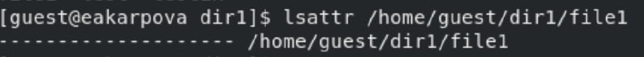
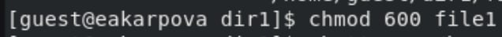
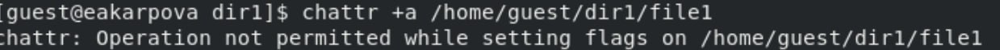
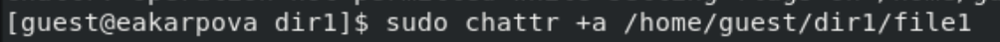
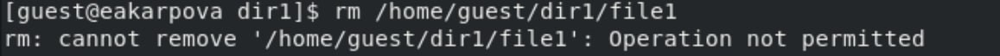
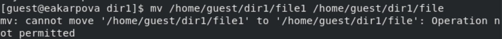
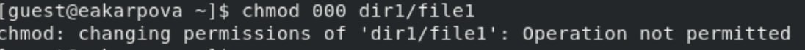
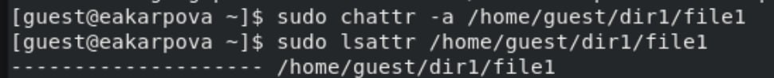
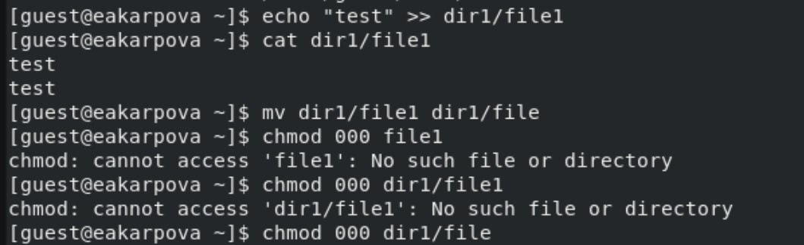
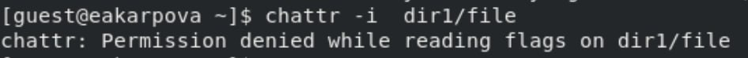

---
## Front matter
title: "Лабораторная работа №4"
subtitle: "Дискреционное разграничение прав в Linux. Расширенные атрибуты"
author: "Карпова Есения"

## Generic otions
lang: ru-RU
toc-title: "Содержание"

## Bibliography
bibliography: bib/cite.bib
csl: pandoc/csl/gost-r-7-0-5-2008-numeric.csl

## Pdf output format
toc: true # Table of contents
toc-depth: 2
lof: true # List of figures
lot: true # List of tables
fontsize: 12pt
linestretch: 1.5
papersize: a4
documentclass: scrreprt
## I18n polyglossia
polyglossia-lang:
  name: russian
  options:
	- spelling=modern
	- babelshorthands=true
polyglossia-otherlangs:
  name: english
## I18n babel
babel-lang: russian
babel-otherlangs: english
## Fonts
mainfont: IBM Plex Serif
romanfont: IBM Plex Serif
sansfont: IBM Plex Sans
monofont: IBM Plex Mono
mathfont: STIX Two Math
mainfontoptions: Ligatures=Common,Ligatures=TeX,Scale=0.94
romanfontoptions: Ligatures=Common,Ligatures=TeX,Scale=0.94
sansfontoptions: Ligatures=Common,Ligatures=TeX,Scale=MatchLowercase,Scale=0.94
monofontoptions: Scale=MatchLowercase,Scale=0.94,FakeStretch=0.9
mathfontoptions:
## Biblatex
biblatex: true
biblio-style: "gost-numeric"
biblatexoptions:
  - parentracker=true
  - backend=biber
  - hyperref=auto
  - language=auto
  - autolang=other*
  - citestyle=gost-numeric
## Pandoc-crossref LaTeX customization
figureTitle: "Рис."
tableTitle: "Таблица"
listingTitle: "Листинг"
lofTitle: "Список иллюстраций"
lotTitle: "Список таблиц"
lolTitle: "Листинги"
## Misc options
indent: true
header-includes:
  - \usepackage{indentfirst}
  - \usepackage{float} # keep figures where there are in the text
  - \floatplacement{figure}{H} # keep figures where there are in the text
---

# Цель работы

Получить практические навыки работы в консоли с расширенными атрибутами файлов

# Теоретическое введение

Атрибуты файлов в Linux обеспечивают контроль доступа и манипуляцию с файлами на более глубоком уровне, чем стандартные разрешения (чтение, запись и выполнение). Расширенные атрибуты, такие как a (append-only) и i (immutable), обеспечивают дополнительную защиту файлов. Атрибут a позволяет добавлять данные к файлу, но не позволяет его изменять или удалять, а атрибут i делает файл неизменяемым, тем самым запрещая любые модификации, включая запись, удаление и переименование.

Использование команды chmod позволяет управлять стандартными правами доступа к файлам. Например, команда chmod 600 file1 наделяет владельца файла правами на чтение и запись, отказывая в доступе остальным пользователям. Это важный шаг для обеспечения безопасности данных, особенно если файл содержит конфиденциальную информацию. При попытке установки расширенного атрибута a от имени пользователя с ограниченными правами система не позволит это сделать, что подчеркивает необходимость административных привилегий для изменения некоторых атрибутов.

Повышение прав пользователя с помощью команды su позволяет администратору (или суперпользователю) устанавливать и изменять атрибуты файлов, которые обычный пользователь не имеет права модифицировать. Например, установка атрибута i на файл ведет к тому, что ни чтение, ни запись не будут возможны, что может понадобиться в случае необходимости предохранить файл от изменений до особых условий. Проверка атрибутов с помощью команды lsattr позволяет удостовериться в правильности изменений и наблюдать, как система реагирует на различные права доступа и атрибуты.

# Выполнение лабораторной работы

От имени пользователя guest определила расширенные атрибуты файла /home/guest/dir1/file1 командой

`lsattr /home/guest/dir1/file1` (рис. [-@fig:001]).

{#fig:001 width=100%}

Установила командой

`chmod 600 file1 `

на файл file1 права, разрешающие чтение и запись для владельца файла (рис. [-@fig:002]).

{#fig:002 width=100%}

Пробую установить на файл /home/guest/dir1/file1 расширенный атрибут от имени пользователя guest:

`chattr +a /home/guest/dir1/file1`

В ответ вы должны получаю отказ от выполнения операции (рис. [-@fig:003]).

{#fig:003 width=100%}

Повышаю свои права с помощью команды su. Пробую установить расширенный атрибут на файл /home/guest/dir1/file1 от имени суперпользователя:

`chattr +a /home/guest/dir1/file1` (рис. [-@fig:004]).

{#fig:004 width=100%}

От пользователя guest проверяю правильность установления атрибута:

`lsattr /home/guest/dir1/file1` (рис. [-@fig:005]).

{#fig:005 width=100%}

Выполняю дозапись в файл file1 слова «test» командой

`echo "test" /home/guest/dir1/file1`

После этого выполняю чтение файла file1 командой

`cat /home/guest/dir1/file1`

Убеждаюсь, что слово test было успешно записано в file1 (рис. [-@fig:006]).

{#fig:006 width=100%}

Попробую удалить файл file1 (рис. [-@fig:007]).

{#fig:007 width=100%}

Пробую перемименовать файл file1 (рис. [-@fig:008]).

{#fig:008 width=100%}

С помощью команды

`chmod 000 file1`

Пробую установить на файл file1 права, запрещающие чтение и запись для владельца файла. Получаю ошибку (рис. [-@fig:009]).

{#fig:009 width=100%}

Снимаю расширенный атрибут -a с файла /home/guest/dirl/file1 от имени суперпользователя командой

`chattr -a /home/guest/dir1/file1` (рис. [-@fig:010]).

{#fig:010 width=100%}

Повторяю операции, которые ранее не удавалось выполнить: теперь все можно выполнить (рис. [-@fig:011]).

{#fig:011 width=100%}

Пробую заменить атрибут -a на -i, но получаю отказ (рис. [-@fig:012]).

{#fig:012 width=100%}

Меняю атрибут от имени суперпользователя (рис. [-@fig:013]).

{#fig:013 width=100%}

Теперь все команды не выполняются (рис. [-@fig:014]).

{#fig:014 width=100%}

# Выводы

В ходе лабораторной работы я получил практические навыки работы в консоли с расширенными атрибутами файлов

