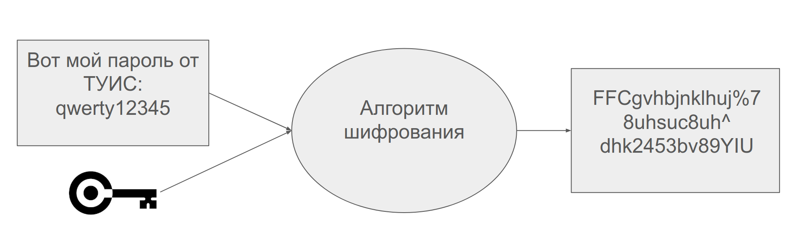
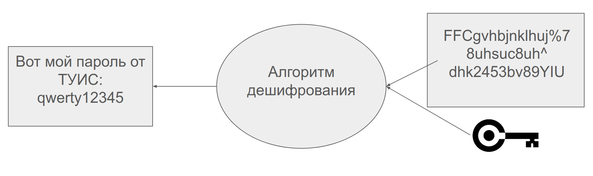
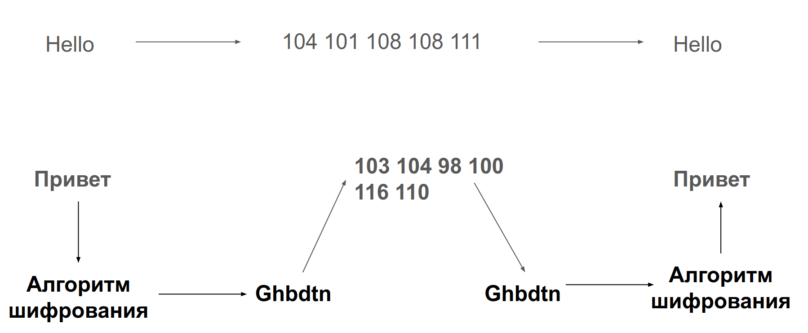
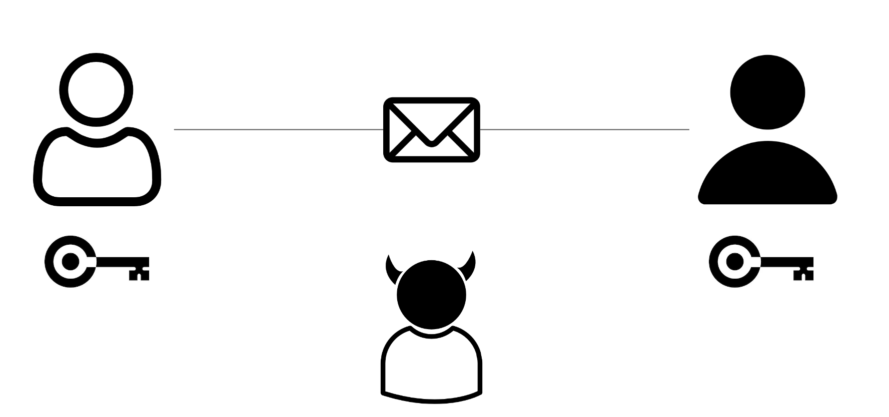
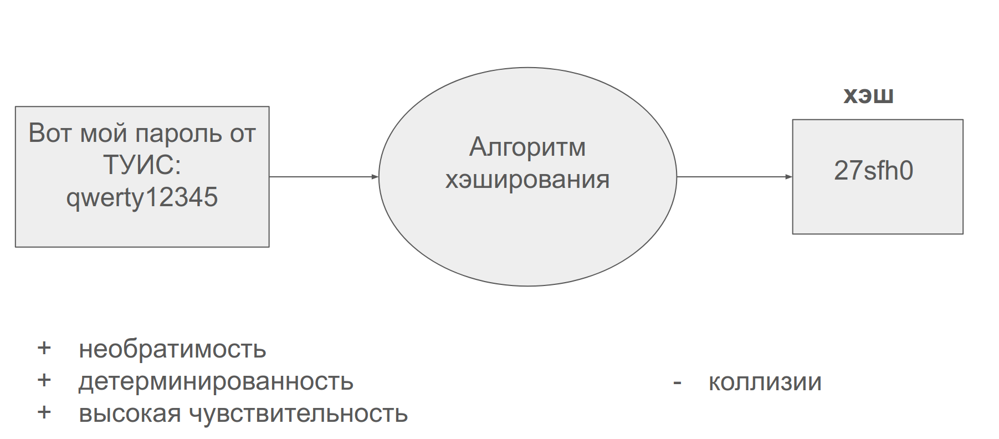
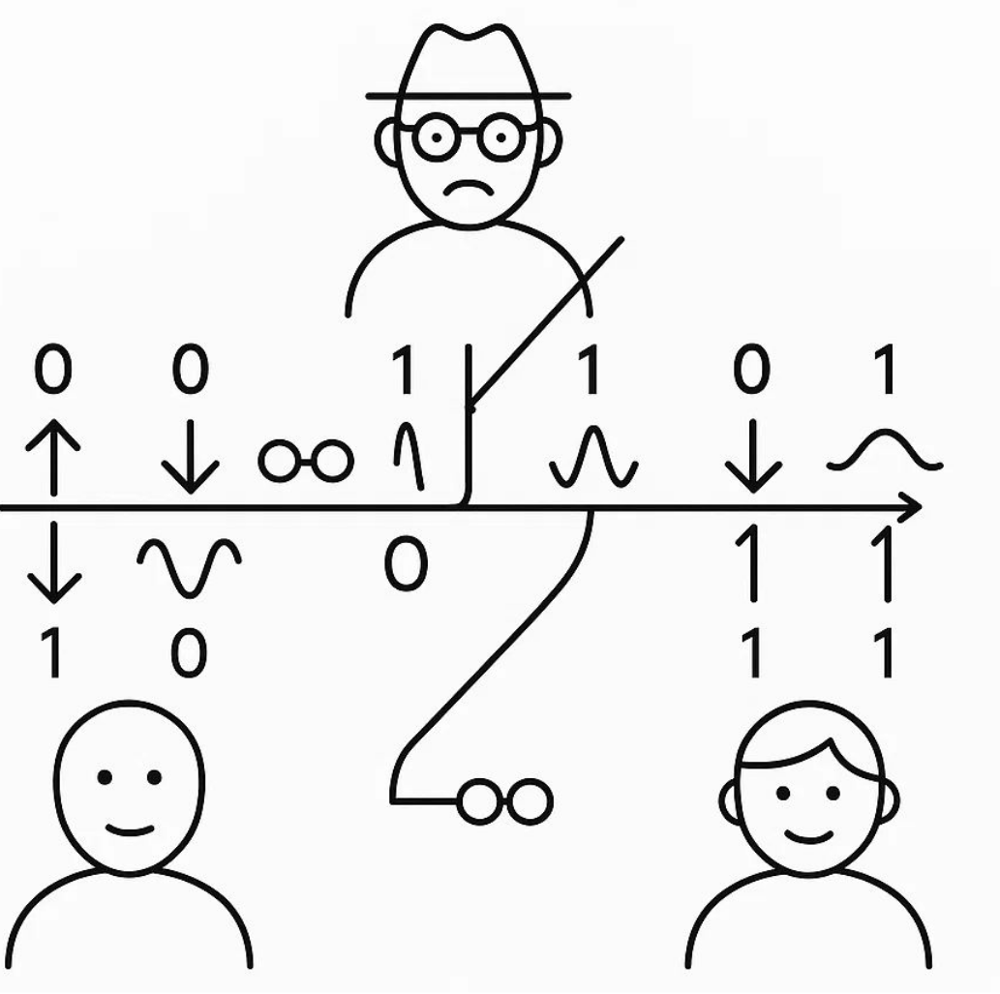

---
## Front matter
lang: ru-RU
title: Общие вопросы шифрования
author:
  - Карпова Е.А.
institute:
  - Российский университет дружбы народов, Москва, Россия
date: 1 мая 2025

## i18n babel
babel-lang: russian
babel-otherlangs: english

## Formatting pdf
toc: false
toc-title: Содержание
slide_level: 2
aspectratio: 169
section-titles: true
theme: metropolis
header-includes:
 - \metroset{progressbar=frametitle,sectionpage=progressbar,numbering=fraction}
---

# Информация

## Докладчик

:::::::::::::: {.columns align=center}
::: {.column width="70%"}

  * Карпова Есения Алексеевна
  * Студентка НКАбд-02-23
  * ФФМиЕН
  * Российский университет дружбы народов
  * [1132236008@pfur.ru](mailto:1132236008@pfur.ru)
  * <https://github.com/eakarpova>

:::
::: {.column width="30%"}

:::
::::::::::::::

# Вводная часть

## Цель

- Объяснить базовые механизмы

- Стимулировать интерес

## Шифрование

- это процесс преобразования читаемого текста в нечитаемый формат с
использованием алгоритма шифрования и ключа

## Дешифрование

- это процесс преобразования нечитаемого текста в нечитаемый формат с
использованием алгоритма дешифрования и ключа

## Кодирование != Шифрование

## Симметричное шифрование

## Асимметричное шифрование

## Криптографическая хэш-функция

+ необратимость

+ детерминированность

+ высокая чувствительность

- коллизии

## Квантовое шифрование

— это способ защищенной передачи данных с помощью фотонов, использующий законы квантовой физики

## Выводы

1. Криптография обеспечивает защиту данных через шифрование и хэш-
функции.

2. Квантовое шифрование открывает новые горизонты безопасности.

3. Криптография постоянно адаптируется к новым угрозам
