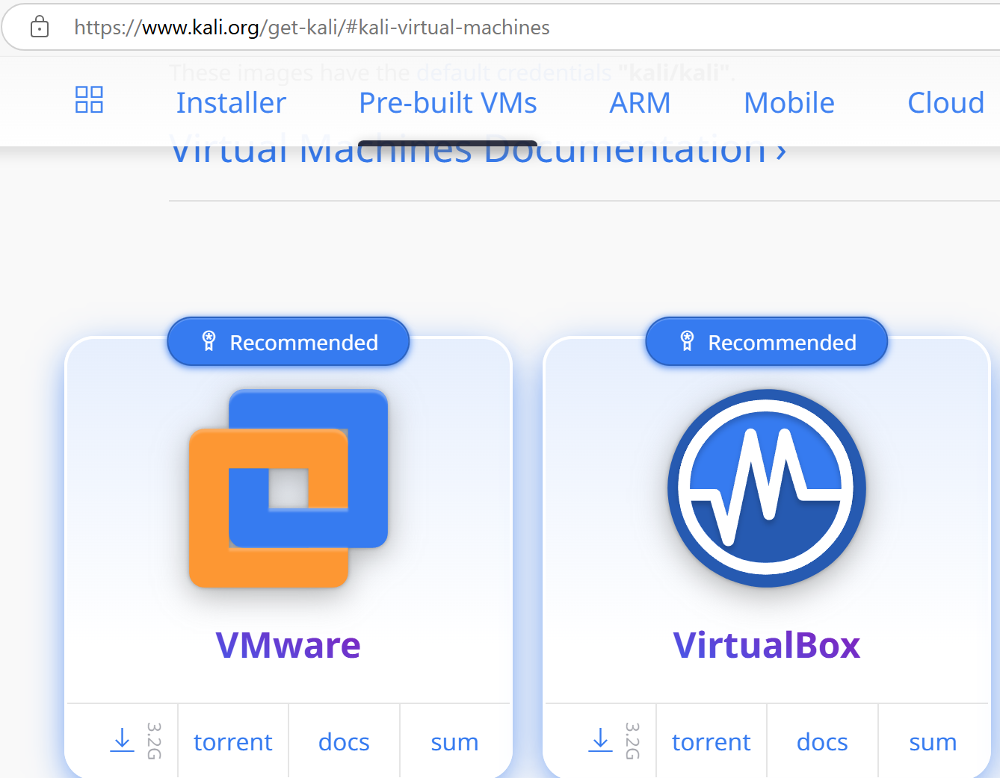
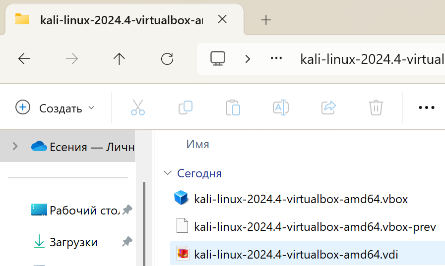
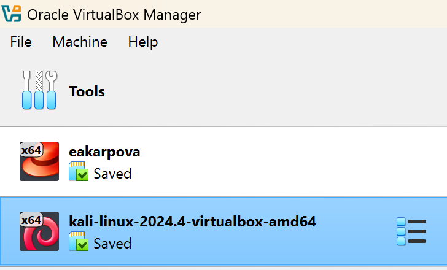
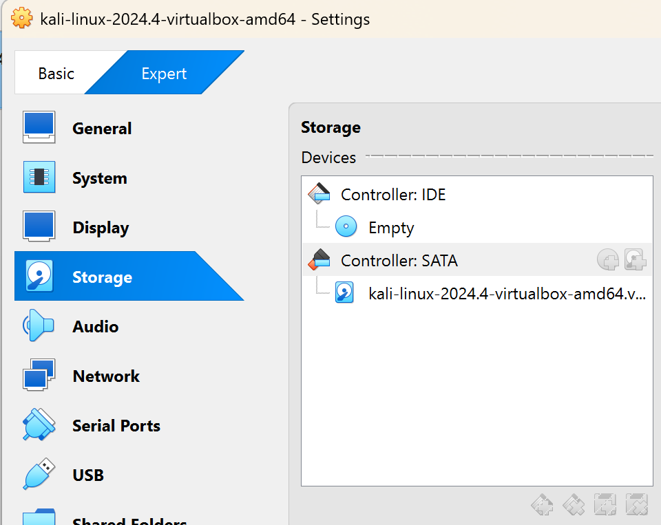
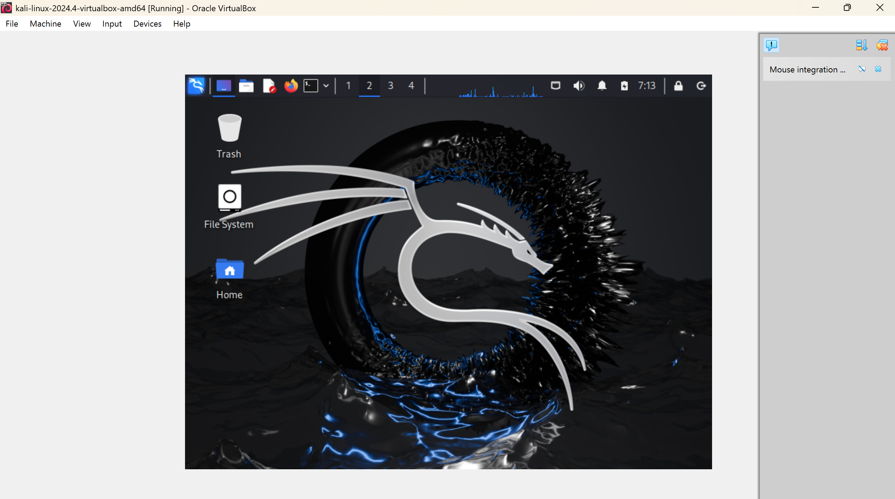

---
## Front matter
title: "Установка Kali"
subtitle: "Индивидуальный проект. Этап 1"
author: "Карпова Есения Алексеевна"

## Generic otions
lang: ru-RU
toc-title: "Содержание"

## Bibliography
bibliography: bib/cite.bib
csl: pandoc/csl/gost-r-7-0-5-2008-numeric.csl

## Pdf output format
toc: true # Table of contents
toc-depth: 2
lof: true # List of figures
lot: true # List of tables
fontsize: 12pt
linestretch: 1.5
papersize: a4
documentclass: scrreprt
## I18n polyglossia
polyglossia-lang:
  name: russian
  options:
	- spelling=modern
	- babelshorthands=true
polyglossia-otherlangs:
  name: english
## I18n babel
babel-lang: russian
babel-otherlangs: english
## Fonts
mainfont: IBM Plex Serif
romanfont: IBM Plex Serif
sansfont: IBM Plex Sans
monofont: IBM Plex Mono
mathfont: STIX Two Math
mainfontoptions: Ligatures=Common,Ligatures=TeX,Scale=0.94
romanfontoptions: Ligatures=Common,Ligatures=TeX,Scale=0.94
sansfontoptions: Ligatures=Common,Ligatures=TeX,Scale=MatchLowercase,Scale=0.94
monofontoptions: Scale=MatchLowercase,Scale=0.94,FakeStretch=0.9
mathfontoptions:
## Biblatex
biblatex: true
biblio-style: "gost-numeric"
biblatexoptions:
  - parentracker=true
  - backend=biber
  - hyperref=auto
  - language=auto
  - autolang=other*
  - citestyle=gost-numeric
## Pandoc-crossref LaTeX customization
figureTitle: "Рис."
tableTitle: "Таблица"
listingTitle: "Листинг"
lofTitle: "Список иллюстраций"
lotTitle: "Список таблиц"
lolTitle: "Листинги"
## Misc options
indent: true
header-includes:
  - \usepackage{indentfirst}
  - \usepackage{float} # keep figures where there are in the text
  - \floatplacement{figure}{H} # keep figures where there are in the text
---

# Цель работы

Узнать о дистрибутиве Kali и разобраться в его установке на виртуальную машину.

# Задание

Установить Kali на Virtual Box.

# Теоретическое введение

Kali Linux — это дистрибутив операционной системы на базе Debian, специально разработанный для тестирования безопасности и проведения оценок уязвимости в компьютерных системах. В нем предустановлено множество инструментов для проведения пенетратестов, анализа безопасности и работы с сетями.

Kali используется профессионалами в области информационной безопасности, включая хакеров и аудиторов, для выявления слабых мест в системах путем выполнения различных тестов на проникновение. Это позволяет организациям улучшать свою защиту и предотвращать потенциальные атаки.

Благодаря горячей поддержке сообщества и регулярным обновлениям, Kali остается актуальным инструментом для как начинающих, так и опытных специалистов в области кибербезопасности.

# Выполнение индивидуального проекта

1. С официального сайта скачиваю установщик для виртуальной машины (рис. [-@fig:001]).

{#fig:001 width=100%}

2. Разархивирую архив со скачанными файлами. Дважды нажимаю по файлу формата .vbox (рис. [-@fig:002]).

{#fig:002 width=100%}

3. В моей предварительно скачанной программе Virtual Box открывается новый образ Kali (рис. [-@fig:003]).

{#fig:003 width=100%}

4. Проверяю образ операционной системы во вклоадке Storage. Он установился автоматически в формате vdi (рис. [-@fig:004]).

{#fig:004 width=100%}

5. Запускаю виртуальную машину. У меня открывается Kali с нужными настройками(рис. [-@fig:005]).

{#fig:005 width=100%}

# Выводы

В ходе лабораторной работы я узнала о дистрибутиве Kali и научилась устанавливать его на виртуальную машину.

