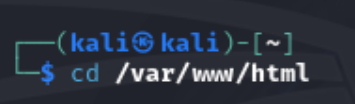
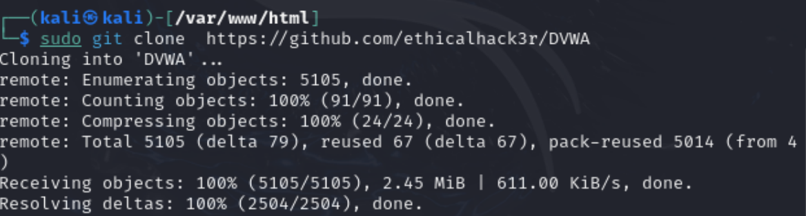
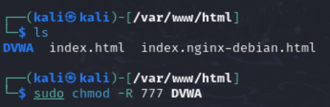
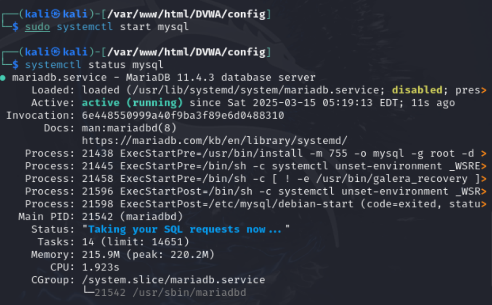
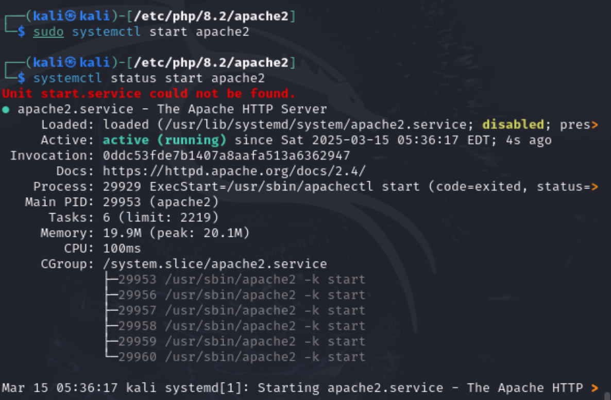

---
## Front matter
lang: ru-RU
title: Индивидуальный проект
subtitle: Этап 2
author:
  - Карпова Е.А.
institute:
  - Российский университет дружбы народов, Москва, Россия
  - Объединённый институт ядерных исследований, Дубна, Россия
date: 15.03.2025

## i18n babel
babel-lang: russian
babel-otherlangs: english

## Formatting pdf
toc: false
toc-title: Содержание
slide_level: 2
aspectratio: 169
section-titles: true
theme: metropolis
header-includes:
 - \metroset{progressbar=frametitle,sectionpage=progressbar,numbering=fraction}
 - '\makeatletter'
 - '\beamer@ignorenonframefalse'
 - '\makeatother'
---

# Информация

## Докладчик

:::::::::::::: {.columns align=center}
::: {.column width="70%"}

  * Карпова Есения Алексеевна
  * Студентка НКАбд-02-23
  * ФФМиЕН
  * Российский университет дружбы народов
  * [1132236008@pfur.ru](mailto:1132236008@pfur.ru)
  * <https://github.com/eakarpova>

:::
::: {.column width="30%"}

:::
::::::::::::::

## Цели и задачи

Установить DVWA на дистрибутив Kali Linux.

# Выполнение индивидуального проекта

## Директория /var/www/html

{#fig:001 width=100%}

## Клонирование репозитория

{#fig:001 width=100%}

## Изменение прав доступа

{#fig:003 width=100%}

## Редактирование файл

{#fig:007 width=100%}

## Запуск mysql

{#fig:008 width=100%}

## Авторизация в базе данных

{#fig:009 width=100%}

## Редактирование файла

{#fig:011 width=100%}

## Запуск apche

{#fig:012 width=100%}

## Создание базы данных

{#fig:014 width=100%}

# Результаты

В ходе лабораторной работы я установила DVWA на дистрибутив Kali Linux.
