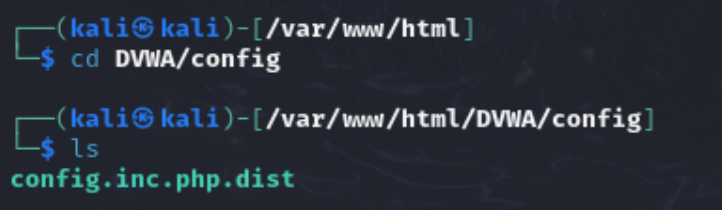
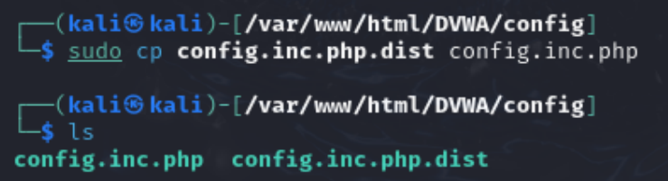
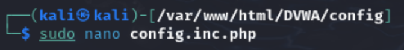
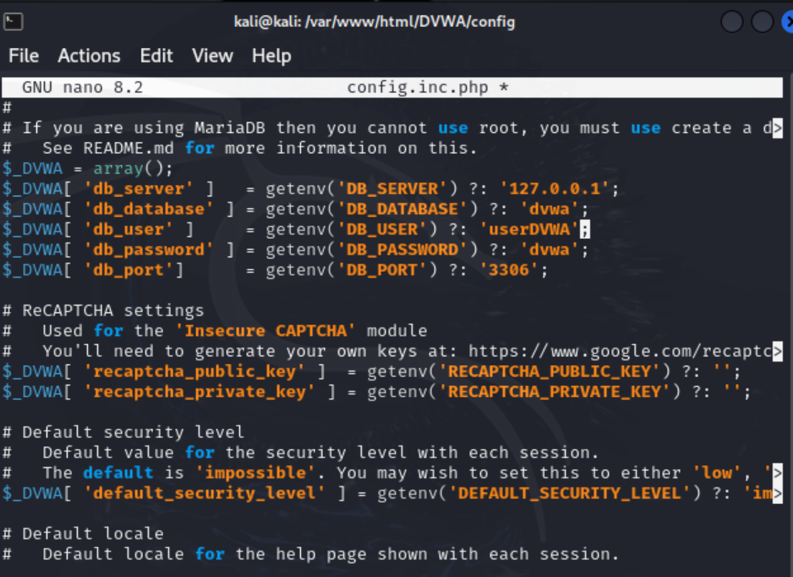
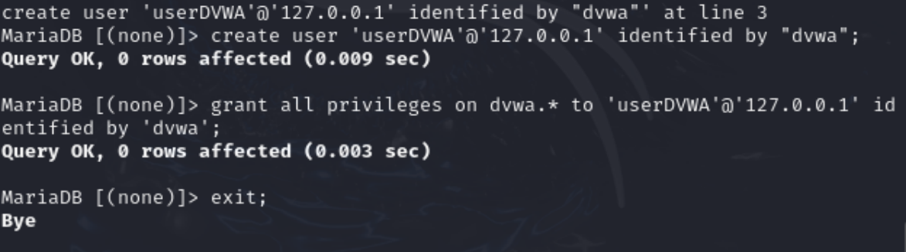
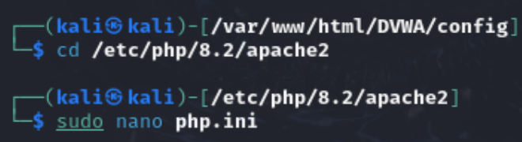
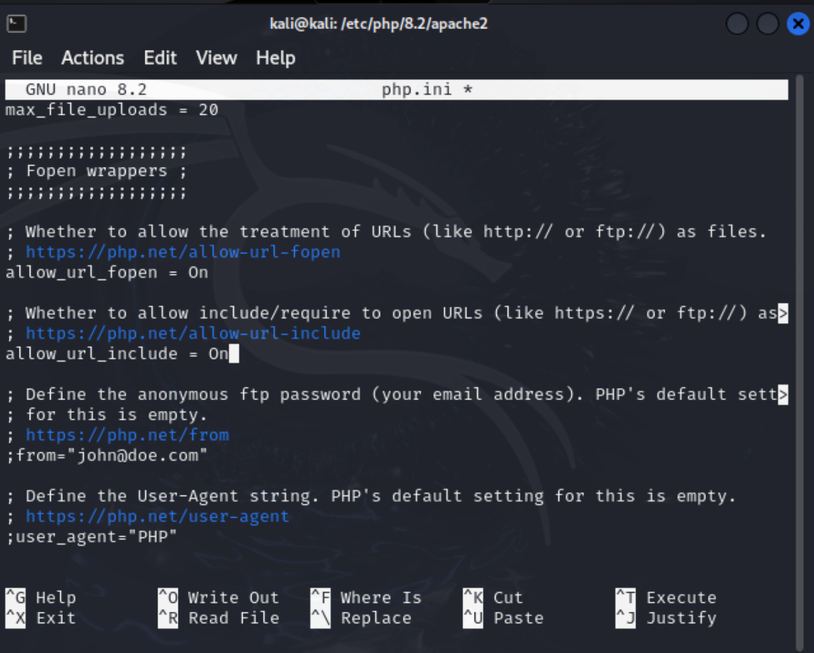
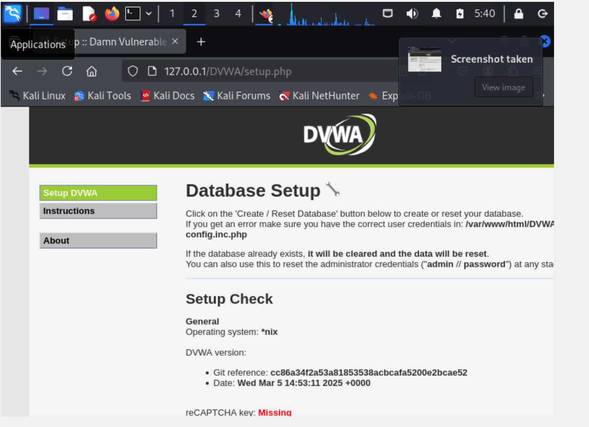
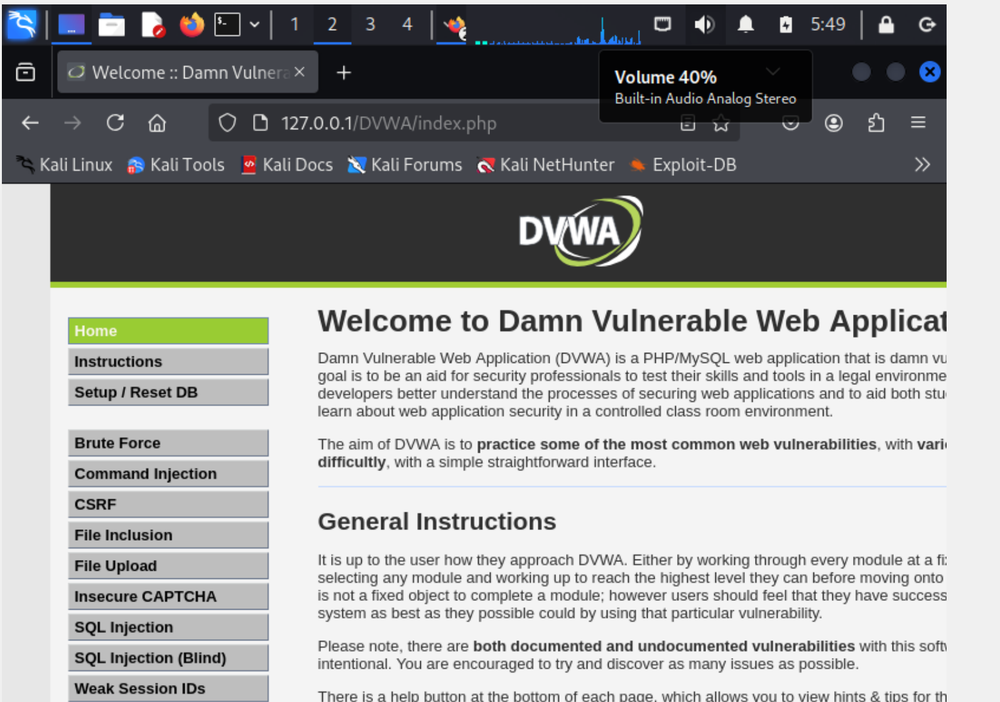

---
## Front matter
title: "Индивидуальный проект"
subtitle: "Этап 2"
author: "Карпова Есения Алексеевна"

## Generic otions
lang: ru-RU
toc-title: "Содержание"

## Bibliography
bibliography: bib/cite.bib
csl: pandoc/csl/gost-r-7-0-5-2008-numeric.csl

## Pdf output format
toc: true # Table of contents
toc-depth: 2
lof: true # List of figures
lot: true # List of tables
fontsize: 12pt
linestretch: 1.5
papersize: a4
documentclass: scrreprt
## I18n polyglossia
polyglossia-lang:
  name: russian
  options:
	- spelling=modern
	- babelshorthands=true
polyglossia-otherlangs:
  name: english
## I18n babel
babel-lang: russian
babel-otherlangs: english
## Fonts
mainfont: PT Serif
romanfont: PT Serif
sansfont: PT Sans
monofont: PT Mono
mainfontoptions: Ligatures=TeX
romanfontoptions: Ligatures=TeX
sansfontoptions: Ligatures=TeX,Scale=MatchLowercase
monofontoptions: Scale=MatchLowercase,Scale=0.9
## Biblatex
biblatex: true
biblio-style: "gost-numeric"
biblatexoptions:
  - parentracker=true
  - backend=biber
  - hyperref=auto
  - language=auto
  - autolang=other*
  - citestyle=gost-numeric
## Pandoc-crossref LaTeX customization
figureTitle: "Рис."
tableTitle: "Таблица"
listingTitle: "Листинг"
lofTitle: "Список иллюстраций"
lotTitle: "Список таблиц"
lolTitle: "Листинги"
## Misc options
indent: true
header-includes:
  - \usepackage{indentfirst}
  - \usepackage{float} # keep figures where there are in the text
  - \floatplacement{figure}{H} # keep figures where there are in the text
---

# Цель работы

Приобретение практических навыков по установке DVWA.

# Задание

Установить DVWA на дистрибутив Kali Linux.

# Теоретическое введение

В данной лабораторной работе будет осуществлена установка Damn Vulnerable Web Application (DVWA) на гостевую систему Kali Linux. DVWA представляет собой учебное веб-приложение, созданное для практики в области безопасности веб-приложений. Оно содержит множество преднамеренно внедренных уязвимостей, что делает его идеальным инструментом для изучения и тестирования методов атаки и защиты.

Ключевыми уязвимостями, которые содержатся в DVWA, являются: брутфорс – метод подбора паролей с целью демонстрации слабости пользователей; выполнение команд (инъекции) – доступ к командной строке операционной системы через веб-приложение; межсайтовая подделка запроса (CSRF) – уязвимость, позволяющая изменить настройки пользователей без их ведома; внедрение файлов – возможность загрузки несанкционированных файлов на сервер; SQL-инъекция – позволяющая внедрять SQL-запросы в поля ввода; небезопасная выгрузка файлов – открытие возможности для загрузки вредоносных файлов; межсайтовый скриптинг (XSS) – внедрение пользовательских скриптов в приложение; а также другие уязвимости, такие как раскрытие полных путей и обход аутентификации.

DVWA предлагает три уровня безопасности, которые позволяют пользователю на практике увидеть, как уязвимости могут быть использованы в реальных сценариях. На уровне "Невозможный" происходит демонстрация безопасного кода и позволяет сравнить его с уязвимым. Уровень "Высокий" представляет собой комбинацию более сложных безопасных и небезопасных практик, где уязвимости ограничены. Уровень "Средний" показывает примеры плохих практик безопасности и неудачных попыток разработчиков создать безопасное приложение. Наконец, уровень "Низкий" полностью уязвим и предназначен для обучения основам эксплуатации.

# Выполнение лабораторной работы

Настройка DVWA происходит на нашем локальном хосте, поэтому нужно перейти в директорию `/var/www/html` (рис. [-@fig:001]).

{#fig:001 width=100%}

Клонирую нужный репозиторий GitHub (рис. [-@fig:002]).

{#fig:002 width=100%}

Проверяю, что файлы склонировались правильно, далее повышаю права доступа к этой папке до 777 (рис. [-@fig:003]).

{#fig:003 width=100%}

Чтобы настроить DVWA, нужно перейти в каталог `/dvwa/config`, затем проверяю содержимое каталога (рис. [-@fig:004]).

{#fig:004 width=100%}

Создаем копию файла, используемого для настройки DVWA `config.inc.php.dist` с именем `config.inc.php`. Копируем файл, чтобы у нас был запасной вариант, если что-то пойдет не так (рис. [-@fig:005]).

{#fig:005 width=100%}

Далее открываю файл в текстовом редакторе (рис. [-@fig:006]).

{#fig:006 width=100%}

Изменяю данные об имени пользователя и пароле (рис. [-@fig:007]).

{#fig:007 width=100%}

По умолчанию в Kali Linux установлен mysql, поэтому можно его запустить без предварительного скачивания, далее выполняю проверку, запущен ли процесс (рис. [-@fig:008]).

{#fig:008 width=100%}

Авторизируюсь в базе данных от имени пользователя root. Появляется командная строка с приглашением "MariaDB", далее создаем в ней нового пользователя, используя учетные данные из файла config.inc.php. Затем предаставляем привилегии для работы с этой базой данных  (рис. [-@fig:009]).

{#fig:009 width=100%}

Необходимо настроить сервер apache2, перехожу в соответствующую директорию. В файле `php.ini` нужно будет изменить один параметр, поэтому открываю файл в текстовом редакторе (рис. [-@fig:010]).

{#fig:010 width=100%}

В файле параметры allow_url_fopen и allow_url_include должны быть поставлены как `On` (рис. [-@fig:011]).

{#fig:011 width=100%}

Запускаем службу веб-сервера apache и проверяем, запущена ли служба (рис. [-@fig:012]).

{#fig:012 width=100%}

Мы настроили DVWA, Apache и базу данных, поэтому открываем браузер и запускаем веб-приложение, введя 127.0.0/DVWA (рис. [-@fig:013]).

{#fig:013 width=100%}

Прокручиваем страницу вниз и нажимем на кнопку `create\reset database`. Авторизуюсь с помощью предложенных по умолчанию данных. Оказываюсь на домшней странице веб-приложения, на этом установка окончена  (рис. [-@fig:014]).

{#fig:014 width=100%}

# Выводы

В ходе выполнения лабораторной работы я приобрела практические навыки по установке уязвимого веб-приложения DVWA.

