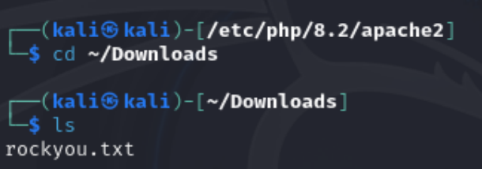
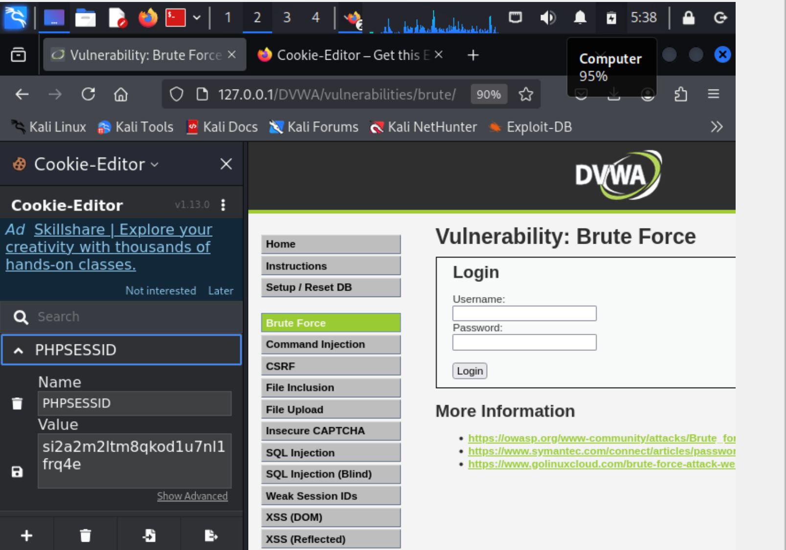
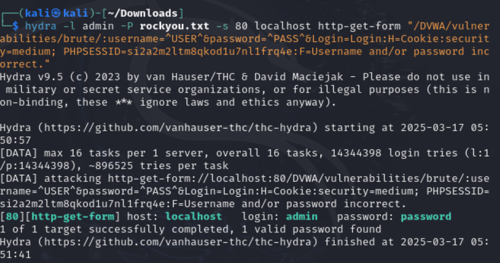
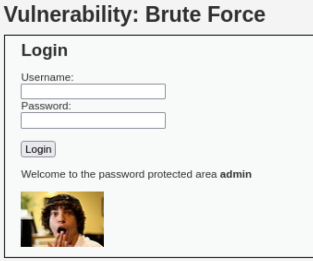

---
## Front matter
title: "Индивидуальный проект"
subtitle: "Этап 3"
author: "Карпова Есения"

## Generic otions
lang: ru-RU
toc-title: "Содержание"

## Bibliography
bibliography: bib/cite.bib
csl: pandoc/csl/gost-r-7-0-5-2008-numeric.csl

## Pdf output format
toc: true # Table of contents
toc-depth: 2
lof: true # List of figures
lot: true # List of tables
fontsize: 12pt
linestretch: 1.5
papersize: a4
documentclass: scrreprt
## I18n polyglossia
polyglossia-lang:
  name: russian
  options:
	- spelling=modern
	- babelshorthands=true
polyglossia-otherlangs:
  name: english
## I18n babel
babel-lang: russian
babel-otherlangs: english
## Fonts
mainfont: IBM Plex Serif
romanfont: IBM Plex Serif
sansfont: IBM Plex Sans
monofont: IBM Plex Mono
mathfont: STIX Two Math
mainfontoptions: Ligatures=Common,Ligatures=TeX,Scale=0.94
romanfontoptions: Ligatures=Common,Ligatures=TeX,Scale=0.94
sansfontoptions: Ligatures=Common,Ligatures=TeX,Scale=MatchLowercase,Scale=0.94
monofontoptions: Scale=MatchLowercase,Scale=0.94,FakeStretch=0.9
mathfontoptions:
## Biblatex
biblatex: true
biblio-style: "gost-numeric"
biblatexoptions:
  - parentracker=true
  - backend=biber
  - hyperref=auto
  - language=auto
  - autolang=other*
  - citestyle=gost-numeric
## Pandoc-crossref LaTeX customization
figureTitle: "Рис."
tableTitle: "Таблица"
listingTitle: "Листинг"
lofTitle: "Список иллюстраций"
lotTitle: "Список таблиц"
lolTitle: "Листинги"
## Misc options
indent: true
header-includes:
  - \usepackage{indentfirst}
  - \usepackage{float} # keep figures where there are in the text
  - \floatplacement{figure}{H} # keep figures where there are in the text
---

# Цель работы

Приобретение практических навыков по использованию инструмента Hydra для брутфорса паролей

# Задание

Реализовать эксплуатацию уязвимости с помощью брутфорса паролей

# Теоретическое введение

Hydra — это мощный инструмент для проведения атак методом "грубой силы" на системы аутентификации, поддерживающий более 50 различных протоколов, включая HTTP, FTP и SSH. Он позволяет пользователям настраивать параметры атак, включая список имен пользователей и паролей, что делает его универсальным решением для тестирования безопасности.

Hydra обеспечивает высокую эффективность подбора паролей за счет использования стратегии параллельной обработки, что позволяет проводить множество попыток аутентификации одновременно. Режим подробного вывода предоставляет возможность следить за каждой попыткой в реальном времени, что упрощает анализ результатов.

Важно понимать, что использование Hydra должно осуществляться только с разрешения, так как атаки на системы без согласия являются незаконными. Инструмент подходит для тестирования собственных систем и обучения, способствуя повышению безопасности и защиту от угроз

# Выполнение лабораторной работы

Из открытых источников я скачиваю файл rockyou.txt со списком частоиспользуемых паролей. Перехожу в папку с файлом (рис. [-@fig:001]).

{#fig:001 width=100%}

Для запроса hydra понадобятся параметры cookie с сайта DVWA, который я открыла в предыдущей лабораторной работе. Чтобы их получить, скачиваю расширение для браузера Cookie-Editor. На панели справа открываются данные PHPSESSID, копирую их (рис. [-@fig:002]).

{#fig:002 width=100%}

Ввожу в Hydra запрос нужную информацию. Использую GET-запрос с найденными ранее параметрами для подбора паролей полльзователя admin. Появляется результат с подходящим паролем (password) (рис. [-@fig:003]).

{#fig:003 width=100%}

Для проверки ввожу полученные данные на сайт, получаю положительный результат (рис. [-@fig:004]).

{#fig:004 width=100%}

# Выводы

В ходе лабораторной работы я приобрела практические навыки по использованию инструмента Hydra для брутфорса паролей

